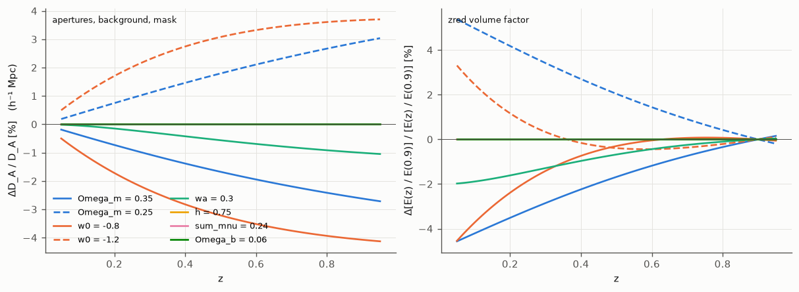
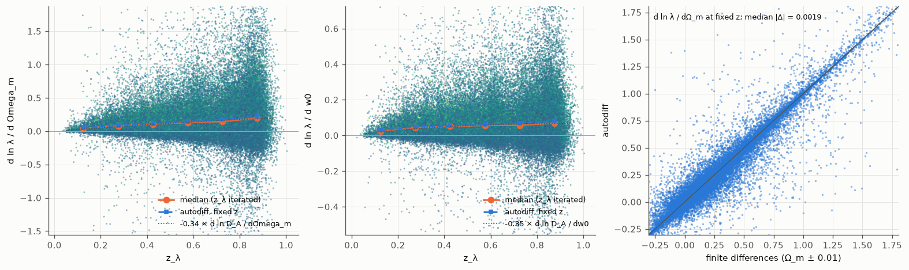
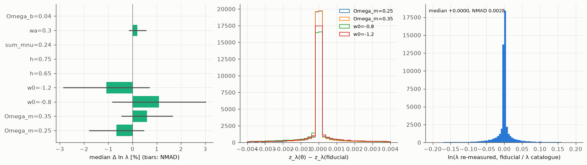
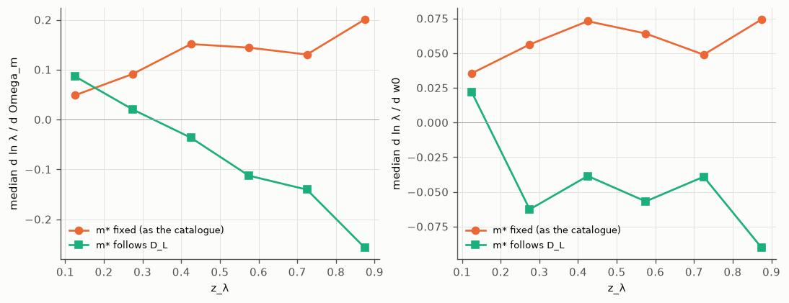
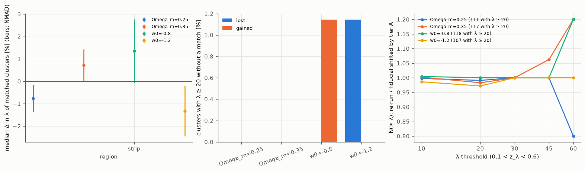

Cosmology and the DR11 cluster counts
=====================================

The cluster finder works in physical apertures (h⁻¹ Mpc) and redMaPPer's zred uses a volume
factor, so the catalogue depends on the cosmology it was run with (Ω_m = 0.3, h = 0.7 for the
DR11 south production). This page measures that dependence and shows its place in a
cosmological analysis of the counts N(λ, z):

1. where the cosmology enters the pipeline;
2. how λ, R_λ, z_λ, SCALEVAL and MASKFRAC of catalogued clusters change with the cosmology
   (tier A: re-measurement at fixed centres, with autodiff derivatives);
3. how the catalogue itself changes: seeds, percolation, selection (tier B: blind re-runs) and
   the red-sequence training (tier C: re-calibration);
4. a model of the counts with a mass–richness relation calibrated by weak lensing, fitted to
   DR11, and the bias of ignoring the finder's response.

The code is in :mod:`rema.modes.remeasure` (``rema remeasure``) and :mod:`rema.abundance`; the
scripts are in ``scripts/cosmo_sens`` and the figures in ``docs/figures/cosmology_sensitivity``
(`Reproduce`_).

Summary
-------

- The finder sees the cosmology through D_A(z) in h⁻¹ Mpc and E(z): **Ω_m and the dark energy
  matter, h and Ω_b do not** (h only through radiation and neutrinos, below 10⁻⁵ in λ).
- **λ grows by 0.7 % for ΔΩ_m = +0.05 and by 1.2 % for Δw0 = +0.2** (median over clusters;
  d ln λ/dΩ_m = +0.05 at z ≈ 0.1 to +0.20 at z ≈ 0.9, an elasticity d ln λ/d ln D_A ≈ −0.4);
  **z_λ does not move**. The response scatters from cluster to cluster by about its own size.
- **Running the whole finder in another cosmology changes nothing more** (tier B on the strip):
  the same clusters, 1–2 % of them with another centre, λ shifted as at fixed centres, and counts
  above each threshold as predicted by that shift.
- **If m* followed the luminosity distance** (a fixed luminosity limit instead of fixed
  apparent magnitudes), the response would change sign above z ≈ 0.3 and be larger
  (d ln λ/dΩ_m ≈ −0.1 to −0.25).
- **In the counts**, the finder's response is about 1 % of d ln N/dΩ_m (the mass function and
  the volume make the rest): d ln N/dΩ_m ≈ +13 to +36 against −0.1 to −0.3 through the finder.
- **Ignoring it biases Ω_m and σ_8 by less than 0.1σ** for DR11 when the catalogue's cosmology is
  off by ΔΩ_m = 0.05 or Δw0 = 0.2: the response looks like a change of the richness
  normalisation and of its redshift evolution, which the mass–richness parameters absorb. With
  m* following D_L the bias would reach 0.2σ (ΔΩ_m = 0.05) and 0.4σ (Δw0 = 0.2).
- **DR11 counts with the DES Y1 weak-lensing calibration** (λ ≥ 20, 0.1 < z < 0.6, 61,300
  clusters): Ω_m ≈ 0.28 ± 0.03 and σ_8 ≈ 0.87–0.90 ± 0.04, with a poor χ² (83–92 for 20 bins) and
  an intrinsic scatter that runs to zero: without projection effects in the model, these numbers
  are a demonstration, not a measurement.

Where the cosmology enters
--------------------------

rema uses two functions of the cosmology, tabulated by :class:`~rema.model.cosmo.CosmoTable` from
:mod:`ggah_mod.cosmology` (flat w0waCDM with massive neutrinos; ``cosmology`` section of the
configuration):

- **D_A(z) in h⁻¹ Mpc** converts every angle into a radius:

  - the radial filter (NFW with core, r_s = 0.15, r_core = 0.1 h⁻¹ Mpc) and the cluster radius
    R_λ = r0 (λ/100)^β (``core/richness.py``);
  - the background per (h⁻¹ Mpc)², Σ_g/D_A², of the richness and of the colour membership PCOL
    that weights the z_λ fit;
  - the mask and depth quadrature behind SCALEVAL and MASKFRAC (``core/maskcorr.py``); MASKFRAC
    < 0.2 is a selection cut;
  - the wcen centring (connectivity, foreground counts, candidates within R_λ), the
    percolation radius R_MASK and the claims of higher-ranked clusters;
  - the read radii of the neighbour searches and the region buffers.

- **E(z)/E(z_ref)**, redMaPPer's volume factor in the zred likelihood (``core/zred.py``):
  ZRED of every galaxy, hence the seeds, the centring and the zred background, and the
  normalisation of the z_λ redshift distribution.

The luminosity limit is a table of apparent magnitudes, m*(z) + 1.75 (``des_z03``): it does not
follow the cosmology. In a consistent treatment it would move by 5 log₁₀ of the ratio of the
luminosity distances; this variant is measured below ("m* follows D_L"). The red-sequence
calibration (red sequence, zred and z_λ corrections, wcen) was trained in Mpc apertures of the
calibration's cosmology (tier C).

Because lengths are in h⁻¹ Mpc, **h only enters through the radiation and neutrino
densities**, and **Ω_b not at all** (it is part of Ω_m): the finder is sensitive to Ω_m and to
the dark energy. The catalogue headers now record the cosmology (OMEGAM, HUBBLE, OMEGAB, MNU, W0,
WA).

   Change of D_A(z) [h⁻¹ Mpc] (left) and of the zred volume factor E(z)/E(0.9) (right) for
   one-at-a-time changes of the parameters around Ω_m = 0.3, w0 = −1. h, Σm_ν and Ω_b are on
   the zero line. A 1 % smaller D_A makes every aperture 1 % larger on the sky.

Tier A: re-measurement at fixed centres
---------------------------------------

``rema remeasure`` takes the clusters of a catalogue and measures them again in other
cosmologies, keeping what the catalogue decided: the centre (``ID_CENT[:, 0]``), the starting
redshift (``Z_LAMBDA_RAW``) and, with ``--members``, the percolation: each neighbour keeps the
free fraction it had when the cluster was measured (members: their ``PFREE``; other galaxies: 1
minus the claims of the higher-ranked clusters' members). For each cosmology the region is
rebuilt with its distances and zred (:meth:`~rema.modes.common.Region.with_cosmology`), z_λ is
iterated in the percolation aperture and λ measured there, with the catalogue's calibration.
``--jvp`` adds the derivatives d ln λ/dθ at fixed redshift by forward-mode autodiff through the
distance table (:meth:`~rema.model.cosmo.CosmoTable.jvp`; the mask completeness is held fixed in
the derivatives, not in the re-measurements), and ``--fd`` the same by central differences.

.. code-block:: bash

   rema remeasure --galaxies GAL --calib CALIB --footprint FP --regions PLAN --region-id I \
       --catalog clusters_dr11.fits --members clusters_dr11_members.fits --lambda-min 10 \
       --vary Omega_m=0.25,0.35 --vary w0=-0.8,-1.2 --jvp Omega_m,w0 --fd --out tierA.fits

The figures use the 815 clusters with λ ≥ 10 of the DR11 combined catalogue in RA 1–4°,
Dec −14 to −1° (inside the local three-sweep strip, the production calibration).

   Left and middle: d ln λ/dΩ_m and d ln λ/dw0 of each cluster (dots, coloured by λ), from
   the re-measurements at Ω_m = 0.25 and 0.35 (w0 = −1.2 and −0.8) with z_λ iterated; medians
   per redshift bin (orange) and the autodiff derivative at fixed redshift (blue). The dotted
   line is a constant elasticity d ln λ/d ln D_A times the change of D_A. Right: autodiff
   against central differences at fixed z.

   Left: median change of ln λ for each one-at-a-time variation (bars: NMAD over the
   clusters). Middle: change of z_λ. Right: the fiducial re-measurement against the catalogue
   (the check that the tool reproduces the catalogue).

Results on the strip:

- **λ grows with Ω_m and with w0** (smaller D_A, so larger apertures on the sky):
  d ln λ/dΩ_m = +0.14 (median over the clusters), from +0.05 at z ≈ 0.1 to +0.20 at z ≈ 0.9;
  d ln λ/dw0 = +0.063. The redshift dependence follows D_A with an elasticity
  d ln λ/d ln D_A ≈ −0.37 (Ω_m) and −0.39 (w0), smaller than the −γ/(1 − βγ) ≈ −0.6 to −0.75
  of a projected NFW profile with N(< R) ∝ R^γ because the background subtracted per
  (h⁻¹ Mpc)² moves with the aperture. Cluster to cluster the response scatters by about
  its own size (NMAD), from the few members that cross the aperture edge.
- **h, Ω_b and Σm_ν do not change λ** (changes of ln λ below 3 × 10⁻⁶); wa = 0.3 changes it
  by +0.2 %.
- **z_λ does not move** (changes below 10⁻⁵): the finder's response to the cosmology is a
  change of richness at fixed redshift.
- **Autodiff and finite differences agree** to 3 × 10⁻⁴ in d ln λ/dΩ_m (median).
- **The fiducial re-measurement reproduces the catalogue**: median ln(λ/λ_cat) = −0.004 (NMAD
  0.03), z_λ to 5 × 10⁻⁵, SCALEVAL and MASKFRAC to 0.002. The scatter comes from the local galaxy
  table and footprint (an earlier ingest) and from the approximate free fractions of non-members.
- For ΔΩ_m = 0.05 the richness moves by 0.7 %, and by 1.2 % for Δw0 = 0.2.

   The response with m* fixed in apparent magnitude (the catalogue, orange) and with m*
   following the luminosity distance (``--mstar-follows-cosmology``, green): a larger Ω_m makes
   D_L smaller, m* brighter, and fewer galaxies brighter than 0.2 L*. Above z ≈ 0.3 this
   luminosity effect wins over the aperture effect and λ falls with Ω_m (median −0.09 per unit
   Ω_m, −0.25 at z ≈ 0.9). With m* following the cosmology, the z_vlim map, and so the area,
   would also depend on it (not done here).

Tiers B and C: re-runs and re-calibration
-----------------------------------------

Tier A keeps the catalogue's centres, percolation and selection. The finder's other decisions
also depend on the cosmology: the seeds (zred), the first-pass aperture, the ranking by the
likelihood (hence the percolation order), the claims within R_MASK, the centring, and the cuts
λ/S ≥ 3 and MASKFRAC < 0.2; and the calibration was trained in Mpc apertures. These are measured
by running the blind mode again on six regions of the DR11 plan, chosen away from the seams and
spanning the depth (regions 15 and 9 in the DES area, 55 intermediate, 82, 91 and 113 in
DECaLS), on CC-IN2P3:

- **tier B**: ``rema blind --cosmology KEY=VALUE`` with the production calibration, for the
  fiducial (the current code), Ω_m = 0.25 and 0.35, w0 = −0.8 and −1.2;
- **tier C**: ``rema calibrate --cosmology KEY=VALUE`` on the production calibration area, then
  the blind mode on regions 15 and 82, for the fiducial, Ω_m = 0.25 and 0.35.

The runs are compared cluster by cluster (matched by central galaxy, then seed, then position and
redshift; :mod:`rema.validate.compare`): changes of λ, R_λ, z_λ and P_CEN, the fraction of
clusters that change centre, the member overlap, and the clusters gained or lost above λ = 20.
The ratio of N(> λ) between the re-run and the tier-A prediction (the fiducial catalogue with λ
shifted by the measured response) gives the selection correction c(λ, z) of the counts model.
``scripts/cosmo_sens/cosmo_sens.sh`` runs the three tiers (`Reproduce`_).

**Tier B on the strip** (the same 3 sweeps and own box as tier A, the production calibration, the
blind mode run five times on the laptop GPU, 20 minutes each):

   Blind re-runs against the fiducial re-run. Left: median change of ln λ of the clusters with
   λ ≥ 20 matched between the runs (bars: NMAD). Middle: clusters with λ ≥ 20 without a match.
   Right: N(> λ) of the re-run over that of the fiducial re-run with λ shifted by the tier-A
   response (1 when the re-measurement at fixed centres explains the change of the counts; at
   λ ≥ 60 one cluster is 20 %).

- All but two of the 175 clusters with λ ≥ 20 are matched, 99 % of them by their central galaxy;
  the two lost (w0 = −1.2) or gained (w0 = −0.8) cross λ = 20 because of the shift of λ.
- The matched clusters move by Δ ln λ = −0.76 % and +0.73 % (Ω_m = 0.25 and 0.35), +1.35 % and
  −1.32 % (w0 = −0.8 and −1.2): tier A gives −0.71 %, +0.66 %, +1.27 % and −1.21 %.
- 0.6 to 2.3 % of the clusters change centre, the median member overlap
  (Σ min(p, p′)/Σ max(p, p′)) is 0.98–0.99, z_λ does not move.
- The counts above each λ threshold follow the tier-A shift to within the noise of the strip: the
  seeds, the percolation order, the centring and the selection cuts add nothing measurable to the
  response of λ, so the counts model uses no selection correction (c = 0).

The counts model
----------------

:mod:`rema.abundance` predicts the counts in bins of λ and z_λ in the volume-limited sky:

.. math::

   N_{ij} = \Omega_j \int dz\, \frac{dV}{dz\,d\Omega}\, K_{ij}(z)
            \int d\ln M\, \frac{dn}{d\ln M}(M, z)\, P_i(M, z),

- **Ω_j**: the area where the depth reaches the bin's upper edge, z_vlim ≥ z_hi (z_vlim: where
  m*(z) + 1.75 reaches the 10σ z-band depth; :class:`~rema.abundance.area.ZvlimMap`), and only
  the clusters there are counted. The area is angular: it does not depend on the cosmology
  while m* is fixed.
- **dn/d ln M**: the Tinker et al. (2008) mass function of M200m, from ggah_mod (the emu_pk
  linear spectrum of the cold matter, σ(M) and its slope by autodiff); dV/dz/dΩ from ggah_mod.
- **P_i(M, z)**: the richness of a halo is log-normal,
  ⟨ln λ_DES | M, z⟩ = a + b ln(M/M_piv) + c ln((1+z)/1.35), with variance σ_int² + (e^μ − 1)/e^{2μ}
  (intrinsic and Poisson, Costanzi et al. 2019), in units of the DES Y1 redMaPPer richness;
  rema's richness is ln λ = ln λ_DES + ln s0 + s1 (z − 0.4), with the normalisation measured on
  common clusters (λ_rema/λ_DES = 1.05 at z = 0.2, 0.85 at z = 0.6; Gaussian priors of width 0.05
  and 0.25).
- **K_ij(z)**: the probability that z_λ falls in bin j, Gaussian with the median z_λ error of the
  clusters of the bin and a bias ``dz_bias``.
- **The finder's response**: if the mass–richness relation describes the richness the finder
  would measure in the true cosmology θ, the catalogue (made at the fiducial) measures
  ln λ_fid = ln λ_θ − R(θ; z, λ), with R the tier-A response table
  (:class:`~rema.abundance.response.ResponseTable`), and z_fid = z_θ − Δz(θ) (zero here). With
  ``response=None`` the catalogue is taken as cosmology independent, as in published analyses.

The **likelihood** (:class:`~rema.abundance.likelihood.Likelihood`) has three parts:

- the counts, Gaussian with the covariance of Poisson noise and super-sample variance
  (σ_b² of each redshift bin's footprint and slab from
  :func:`ggah_mod.covariance.supersample.slab_sigma2_b`; it adds 30–40 % to the Poisson variance
  of the most populated bins), computed at the best fit;
- the **weak-lensing calibration**: in the bins inside the range of McClintock et al. (2019)
  (DES Y1, λ_DES ≥ 20, 0.2 ≤ z ≤ 0.65), the model's ln ⟨M200m | bin⟩ against their
  ⟨M | λ, z⟩ = M0 (λ/40)^F ((1+z)/1.35)^G at the bin's mean richness in DES units, with the
  covariance of (log₁₀ M0, F, G) = (14.489 ± 0.022 in M☉ for h = 0.7, 1.356 ± 0.052, −0.30 ± 0.31)
  and 5 % per bin. This calibrates a, b, c and σ_int the way the DES Y1 cluster analysis did;
  inverting ⟨M | λ⟩ into ⟨λ | M⟩ would ignore the Eddington bias (it over-predicts the DR11
  counts by a factor 2–3);
- priors: Planck 2018 on h (0.6736 ± 0.0054) and n_s (0.9649 ± 0.0042), BBN on Ω_b h²
  (0.02237 ± 0.00015), flat on Ω_m, ln 10¹⁰A_s and the mass–richness parameters, and the emu_pk
  training box. σ_8 is derived.

:mod:`rema.abundance.fisher` gives Fisher matrices (forward-mode Jacobians through the whole
model) and the shift of the best fit for a change of the data; :mod:`rema.abundance.sampling`
the best fit (L-BFGS-B), the Laplace covariance and NUTS chains (blackjax, extra ``cosmo``).

The DR11 data vector
--------------------

λ ≥ 20 in five bins (20, 30, 45, 60, 100, ∞) and z_λ in four (0.1, 0.2, 0.3, 0.45, 0.6): the
z_λ spikes at 0.82–0.86 are left out and the one at 0.38 sits inside a bin. Clusters and pixels
within 2.33° of the seams between the two parts of the run are left out: 61,300 clusters over
17,790 deg² (17,110 deg² for the last redshift bin).

Fit and forecast
----------------

.. include:: figures/cosmology_sensitivity/results.rst

Assumptions and limits
----------------------

- **The weak-lensing calibration is a fixed function.** McClintock et al. computed their
  masses with Ω_m = 0.3, h = 0.7: the lensing masses also depend on the cosmology (Σ_crit and the
  mean density in M200m), which is not modelled. Their relation is used at the mean richness of
  each bin, not with their stacked profiles.
- **No projection effects, purity or completeness model.** The DR11 abundance at fixed λ
  depends on depth (≈ 20 % more clusters in the shallow DECaLS sky at 0.5 < z < 0.6; density
  against depth in :doc:`redmapper_dr11`), a sign of projections. The absolute Ω_m and σ_8 are
  therefore not a
  cosmological result; the difference between the fits with and without the response, and the
  deep/shallow comparison, are.
- **Tier A on one strip.** The response table comes from 815 clusters of one strip until the
  six CC regions are re-measured; its λ dependence above λ ≈ 40 is extrapolated.
- **The mass function** is Tinker et al. (2008) without a calibration uncertainty.

Reproduce
---------

Locally (the reduced tables of ``docs/figures/redmapper_dr11/prepare.py`` and the combined
catalogue; ``REMA_COSMO`` is where the results go):

.. code-block:: bash

   # tier A on the strip (galaxies of 3 sweeps, production calibration)
   rema remeasure --galaxies strip/galaxies_3sweeps_v2.fits --calib CALIB --footprint strip/footprint_strip.fits \
       --catalog clusters_dr11.fits --members clusters_dr11_members.fits --box 0 5 -15 0 --own 1 4 -14 -1 \
       --vary Omega_m=0.25,0.35 --vary w0=-0.8,-1.2 --vary h=0.65,0.75 --vary Omega_b=0.04 \
       --vary sum_mnu=0.24 --vary wa=0.3 --jvp Omega_m,w0,h --fd --lambda-min 10 --out $REMA_COSMO/tierA/strip.fits
   python scripts/cosmo_sens/build_response.py $REMA_COSMO/tierA/strip.fits --degree 1,1 \
       --out $REMA_COSMO/response_strip.fits
   python scripts/cosmo_sens/fit_dr11.py --response $REMA_COSMO/response_strip.fits --tag all
   python scripts/cosmo_sens/forecast.py --response $REMA_COSMO/response_strip.fits --fit $REMA_COSMO/fit_all.json
   python docs/figures/cosmology_sensitivity/make_all.py

On CC-IN2P3 (:doc:`ccin2p3`), tiers A, B and C on the six regions:

.. code-block:: bash

   source $REMA/scripts/slurm/ccin2p3.env      # with the rema environment active
   $REMA/scripts/cosmo_sens/cosmo_sens.sh prepare    # galaxies, randoms index, catalogue copy
   $REMA/scripts/cosmo_sens/cosmo_sens.sh tierA
   $REMA/scripts/cosmo_sens/cosmo_sens.sh tierB
   $REMA/scripts/cosmo_sens/cosmo_sens.sh tierC
   $REMA/scripts/cosmo_sens/cosmo_sens.sh status
