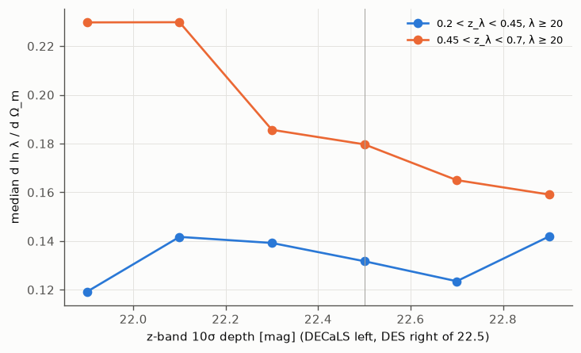
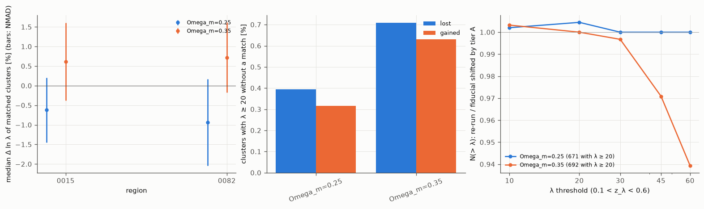
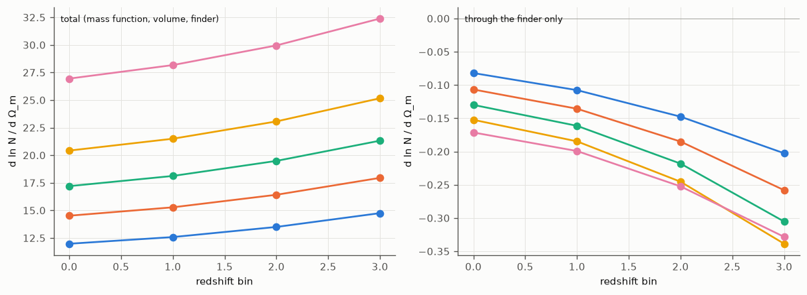
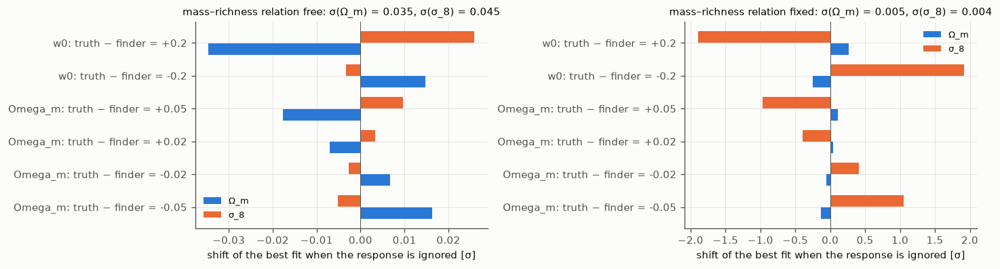
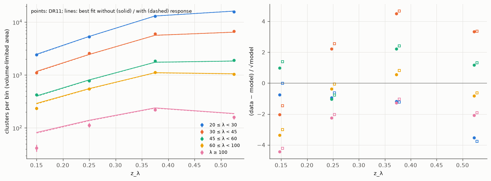
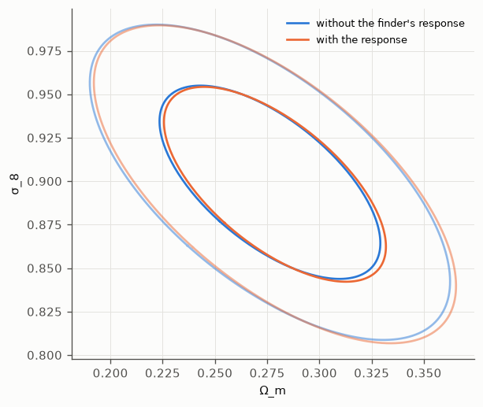

Cosmology and the DR11 cluster counts
=====================================

The DR11 south catalogue was made in one cosmology (Ω_m = 0.3, h = 0.7): rema measures the
richness in apertures of fixed physical size (h⁻¹ Mpc) and computes zred with redMaPPer's volume
factor, so its catalogue depends on that choice. This page measures how much, and what it does
to a cosmological analysis of the cluster counts N(λ, z) with a mass–richness relation calibrated
by weak lensing.

The study used 52,800 catalogued clusters re-measured in other cosmologies at fixed centres
(**tier A**, six regions of the production plan and one strip), the blind mode re-run in other
cosmologies on the same regions (**tier B**) and with a calibration re-trained in them (**tier
C**), and a model of the DR11 counts (61,300 clusters with λ ≥ 20 at 0.1 < z_λ < 0.6) fitted with
and without the finder's response. The method is described after the findings; the code is
:mod:`rema.modes.remeasure` (``rema remeasure``), :mod:`rema.abundance` and ``scripts/cosmo_sens``
(`Reproduce`_).

Findings
--------

1. Only Ω_m and the dark energy reach the finder
~~~~~~~~~~~~~~~~~~~~~~~~~~~~~~~~~~~~~~~~~~~~~~~~

The finder sees the cosmology through two functions: the angular diameter distance D_A(z) in
h⁻¹ Mpc, which turns every angle into a radius, and E(z), the expansion rate in zred's volume
factor. Lengths in h⁻¹ Mpc do not depend on h, and Ω_b is part of Ω_m: **h, Ω_b and Σm_ν change
λ by less than 3 × 10⁻⁶**. Ω_m = 0.35 makes D_A 1.1 % smaller at z = 0.3 and 1.7 % at z = 0.5;
w0 = −0.8 makes it 2.3 % and 3.2 % smaller.

.. figure:: figures/cosmology_sensitivity/distances.png
   :alt: Relative change of D_A and of the zred volume factor against redshift

   Change of D_A(z) [h⁻¹ Mpc] (left) and of the zred volume factor E(z)/E(0.9) (right) for
   one-at-a-time changes of the parameters around Ω_m = 0.3, w0 = −1; h, Σm_ν and Ω_b are on the
   zero line. A 1 % smaller D_A makes every aperture 1 % larger on the sky.

2. The richness moves at the per-cent level, the redshift does not
~~~~~~~~~~~~~~~~~~~~~~~~~~~~~~~~~~~~~~~~~~~~~~~~~~~~~~~~~~~~~~~~~~

A smaller D_A means larger apertures on the sky, and more members: **λ changes by +0.6 % and
−0.7 % for Ω_m = 0.35 and 0.25, and by ±1.1 % for w0 = −0.8 and −1.2** (medians over the 52,800
clusters). d ln λ/dΩ_m = +0.12 and d ln λ/dw0 = +0.055; wa = 0.3 adds 0.2 %. The response
follows the change of D_A with an elasticity d ln λ/d ln D_A ≈ −0.35, about half the −0.6 to
−0.75 of a projected NFW profile, because the background subtracted per (h⁻¹ Mpc)² grows with the
aperture too. From cluster to cluster it scatters by about its own size: a few members cross the
aperture edge. **z_λ does not move** (changes below 10⁻⁵): the finder's cosmology dependence is a
change of richness at fixed redshift.

The derivatives by forward-mode autodiff through the distance table agree with finite
differences (median difference 0.002), and the re-measurement in the fiducial cosmology gives back
the catalogue (median ln(λ/λ_cat) below 10⁻⁵, NMAD 0.3 %).

.. figure:: figures/cosmology_sensitivity/response_lambda.png
   :alt: d ln lambda / d Omega_m and d ln lambda / d w0 against z, and autodiff against finite differences

   d ln λ/dΩ_m (left) and d ln λ/dw0 (middle) of each cluster (dots, coloured by λ), from the
   re-measurements at Ω_m = 0.25 and 0.35 (w0 = −1.2 and −0.8) with z_λ iterated; medians per
   redshift bin (orange), the autodiff derivative at fixed redshift (blue), and a constant
   elasticity times the change of D_A (dotted). Right: autodiff against central differences.

.. figure:: figures/cosmology_sensitivity/response_checks.png
   :alt: Median change of lambda for each parameter; change of z_lambda; re-measured against catalogue lambda

   Left: median change of ln λ for each one-at-a-time change (bars: NMAD over the clusters).
   Middle: change of z_λ. Right: the fiducial re-measurement against the catalogue.

3. More at high redshift, for rich clusters and in shallow data
~~~~~~~~~~~~~~~~~~~~~~~~~~~~~~~~~~~~~~~~~~~~~~~~~~~~~~~~~~~~~~~

d ln λ/dΩ_m grows from +0.04 at z ≈ 0.1 to +0.19 at z ≈ 0.9, as the change of D_A does, and is
0.15–0.27 for λ ≥ 20. At 0.45 < z < 0.7 it is **0.23 in the shallowest DECaLS sky and 0.16 in the
deepest DES sky**: in shallow data a larger part of λ comes from the depth correction (SCALEVAL),
whose aperture also moves with D_A. Below z = 0.45 it does not depend on the depth (≈ 0.13).

   Median d ln λ/dΩ_m of the clusters with λ ≥ 20 against the z-band 10σ depth at their
   position, in two ranges of z_λ.

4. Running the whole finder again changes nothing more
~~~~~~~~~~~~~~~~~~~~~~~~~~~~~~~~~~~~~~~~~~~~~~~~~~~~~~

Re-run blind in another cosmology (tier B: Ω_m = 0.25 and 0.35, w0 = −0.8 and −1.2, six
regions), the finder makes the **same catalogue**: 99.1–99.7 % of the 4,048 clusters with
λ ≥ 20 are found again (98 % with the same central galaxy), and the 0.3–1 % lost or gained are
those that the shift of λ moves across λ = 20. λ moves by −1.0 %, +0.9 %, +1.6 % and −1.7 %, as
at fixed centres; 1.5–2 % of the clusters change centre, the member lists overlap at 97–98 %,
and z_λ does not move. **The counts above each threshold are those of the fiducial catalogue
with λ shifted by the tier-A response**, within 0.5 % at λ ≥ 10, 20 and 30 and within 1–3 % at
λ ≥ 45 and 60: the seeds, the percolation order, the centring and the cuts add nothing
measurable. Re-training the red sequence, the zred and z_λ corrections and the centring model in
the other cosmology (tier C) **absorbs 10–15 % of the shift of λ** (−0.6 % and −0.9 % instead of
−0.7 % and −1.0 % for Ω_m = 0.25 in regions 15 and 82).

.. figure:: figures/cosmology_sensitivity/rerun_tierB.png
   :alt: Change of lambda of matched clusters, clusters lost or gained, and N(>lambda) ratios between re-runs

   Tier B, blind re-runs against the fiducial re-run with the production calibration. Left:
   median change of ln λ of the matched clusters with λ ≥ 20, per region (bars: NMAD). Middle:
   clusters with λ ≥ 20 without a match. Right: N(> λ) at 0.1 < z_λ < 0.6 summed over the
   regions, over that of the fiducial re-run with λ shifted by the tier-A response.

   Tier C: the same with a calibration made in the other cosmology, on regions 15 (DES) and 82
   (DECaLS).

5. The luminosity limit matters as much as the apertures
~~~~~~~~~~~~~~~~~~~~~~~~~~~~~~~~~~~~~~~~~~~~~~~~~~~~~~~~

The richness counts galaxies brighter than 0.2 L*, with m*(z) a table of apparent magnitudes
that the catalogue keeps whatever the cosmology. If instead m* followed the luminosity distance
(a fixed luminosity), a larger Ω_m would make m* brighter and remove faint members: **the
response would change sign above z ≈ 0.3** and reach d ln λ/dΩ_m ≈ −0.25 to −0.5 at z > 0.7
(median −0.18). Which convention the mass–richness relation assumes is part of the comparison.

.. figure:: figures/cosmology_sensitivity/response_mstar.png
   :alt: Median d ln lambda / d Omega_m and d w0 against z, with m* fixed and with m* following D_L

   Median response with m* fixed in apparent magnitude (the catalogue, orange) and with m*
   following the luminosity distance (``--mstar-follows-cosmology``, green).

6. In the counts, the finder is 1 % of the cosmology dependence
~~~~~~~~~~~~~~~~~~~~~~~~~~~~~~~~~~~~~~~~~~~~~~~~~~~~~~~~~~~~~~~

The counts depend on Ω_m through the mass function and the volume: d ln N/dΩ_m = +12 to +32 in
the DR11 bins (median +19). The finder's response adds −0.08 to −0.34 (median −0.18), of the
opposite sign: **about 1 %**.

   d ln N/dΩ_m in each bin of the data vector (lines: the five richness bins), total (left) and
   through the finder's response only (right).

7. Ignoring it biases nothing today, but would with a precise mass calibration
~~~~~~~~~~~~~~~~~~~~~~~~~~~~~~~~~~~~~~~~~~~~~~~~~~~~~~~~~~~~~~~~~~~~~~~~~~~~~~

Fitting the counts of a catalogue made in a cosmology off by ΔΩ_m = 0.05 or Δw0 = 0.2 with a
model that ignores the response **shifts Ω_m and σ_8 by less than 0.05σ**: the response looks like
a change of the normalisation of the mass–richness relation and of its redshift evolution, which
the free parameters of the relation absorb. **With the relation known exactly**, the counts alone
would constrain Ω_m to 0.005 and σ_8 to 0.004, and the same offsets would **shift σ_8 by 1σ
(ΔΩ_m = 0.05) to 2σ (Δw0 = 0.2)**, Δσ_8 ≈ 0.004–0.007: the finder's cosmology starts to matter
once the mass–richness relation is calibrated to about 1 %. With m* following the luminosity
distance the shifts are similar (0.6–2.6σ with the relation fixed).

.. include:: figures/cosmology_sensitivity/forecast_table.rst

   Shift of the best fit, in units of its error, when the response (m* fixed) is ignored, for a
   catalogue made in a cosmology off by the offset on the left: mass–richness relation free (left)
   and fixed (right).

The table gives these shifts (Ω_m, then σ_8, in units of their errors) for the catalogue's m* and
for m* following D_L, with the mass–richness relation free, with its richness normalisation
fixed, and entirely fixed.

8. The DR11 counts give Ω_m ≈ 0.28 and σ_8 ≈ 0.87–0.90, as a demonstration
~~~~~~~~~~~~~~~~~~~~~~~~~~~~~~~~~~~~~~~~~~~~~~~~~~~~~~~~~~~~~~~~~~~~~~~~~~~

With the DES Y1 weak-lensing calibration of McClintock et al. (2019), Planck priors on h and n_s
and BBN on Ω_b, the DR11 counts give **Ω_m = 0.276 ± 0.035 and σ_8 = 0.90 ± 0.04** (0.87 if the
intrinsic scatter is free; it then runs to zero). Including the finder's response moves them by
less than 0.005. The fit is poor (χ² = 83–103 for 20 bins): the model has no projection effects
and no purity, and the DR11 abundance at fixed λ depends on the depth. These numbers show what
the machinery does; they are not a cosmological measurement.

.. include:: figures/cosmology_sensitivity/fit_table.rst

   The DR11 counts in the volume-limited sky (points, Poisson errors) and the best fits with σ_int
   = 0.25 without (solid) and with (dashed) the finder's response; right: residuals in units of
   the Poisson error (dots: without, squares: with the response).

   Ω_m–σ_8 (68 and 95 %, Fisher matrix at each best fit) without and with the finder's response.

How it was measured
-------------------

Where the cosmology enters
~~~~~~~~~~~~~~~~~~~~~~~~~~

rema tabulates D_A, the comoving distance, E(z) and the volume element with
:class:`~rema.model.cosmo.CosmoTable` from :mod:`ggah_mod.cosmology` (flat w0waCDM with massive
neutrinos; the ``cosmology`` section of the configuration, ``--cosmology KEY=VALUE`` on the
command line). The table is a JAX pytree whose leaves are all arrays: another cosmology does not
recompile the kernels, and :meth:`~rema.model.cosmo.CosmoTable.jvp` gives its derivatives.

- **D_A(z)** converts angles into radii for: the radial filter (NFW with core, r_s = 0.15,
  r_core = 0.1 h⁻¹ Mpc) and the radius R_λ = r0 (λ/100)^β; the background per (h⁻¹ Mpc)² of the
  richness and of the colour membership that weights the z_λ fit; the mask and depth quadrature
  behind SCALEVAL and MASKFRAC (MASKFRAC < 0.2 is a cut); the centring (connectivity, foreground
  counts, candidates within R_λ); the percolation radius R_MASK; the neighbour searches.
- **E(z)/E(z_ref)** is redMaPPer's volume factor in the zred likelihood (ZRED of every galaxy,
  hence the seeds, the centring and the zred background) and normalises the z_λ redshift
  distribution.
- The luminosity limit m*(z) + 1.75 is a table of apparent magnitudes (``des_z03``) and the
  calibration (red sequence, zred and z_λ corrections, centring model) was trained in apertures
  of the calibration's cosmology.

Catalogues and calibrations record the cosmology in their headers (OMEGAM, HUBBLE, OMEGAB, MNU,
W0, WA); the combined DR11 catalogue has OMEGAM and HUBBLE and its configuration.

Tier A: re-measurement at fixed centres
~~~~~~~~~~~~~~~~~~~~~~~~~~~~~~~~~~~~~~~

``rema remeasure`` measures the clusters of a catalogue again in other cosmologies, keeping what
the catalogue decided: the centre (``ID_CENT[:, 0]``), the starting redshift (``Z_LAMBDA_RAW``)
and, with ``--members``, the percolation: each neighbour keeps the free fraction it had when the
cluster was measured (members: their ``PFREE``; other galaxies: 1 minus the claims of the
higher-ranked clusters' members). For each cosmology the region is rebuilt with its distances and
zred (:meth:`~rema.modes.common.Region.with_cosmology`), z_λ is iterated in the percolation
aperture and λ measured there, with the catalogue's calibration. ``--jvp`` adds d ln λ/dθ at fixed
redshift by forward-mode autodiff (the mask completeness held fixed), ``--fd`` the same by central
differences, ``--mstar-follows-cosmology`` the variant of finding 5.

.. code-block:: bash

   rema remeasure --galaxies GAL --calib CALIB --footprint FP --regions PLAN --region-id I \
       --catalog clusters_dr11.fits --members clusters_dr11_members.fits --lambda-min 5 \
       --vary Omega_m=0.25,0.35 --vary w0=-0.8,-1.2 --jvp Omega_m,w0 --fd --out tierA.fits

Regions 15 and 9 (DES area), 55 (intermediate), 82, 91 and 113 (DECaLS) of the production plan
were re-measured on CC-IN2P3 (6,200 to 10,700 clusters with λ ≥ 5 each, 7–10 minutes per region on
a V100, galaxy tables ingested again), and the strip RA 1–4°, Dec −14 to −1° on a laptop (815
clusters with λ ≥ 10, from an earlier local ingest: the fiducial re-measurement scatters by 3 %
there, by 0.06–0.6 % in the six regions). The response table of the counts model
(:class:`~rema.abundance.response.ResponseTable`) is the median d ln λ/dθ of the six regions in
bins of z_λ and λ, smoothed by a polynomial (quadratic in z, linear in ln λ).

Tiers B and C: re-runs and re-calibration
~~~~~~~~~~~~~~~~~~~~~~~~~~~~~~~~~~~~~~~~~

Tier A keeps the catalogue's centres, percolation and selection, which also depend on the
cosmology (zred seeds, the likelihood that orders the percolation, R_MASK, the centring, the cuts
λ/S ≥ 3 and MASKFRAC < 0.2), and its calibration. Tier B runs ``rema blind --cosmology KEY=VALUE``
with the production calibration on the six regions (and the strip), for the fiducial,
Ω_m = 0.25 and 0.35, w0 = −0.8 and −1.2 (20–60 minutes per run on a V100). Tier C runs
``rema calibrate --cosmology KEY=VALUE`` on the production calibration area (2 hours on 8 cores)
and the blind mode with that calibration on regions 15 and 82, for the fiducial, Ω_m = 0.25 and
0.35. The runs are compared cluster by cluster with :mod:`rema.validate.compare` (matched by
central galaxy, then seed, then position and redshift).

The counts model
~~~~~~~~~~~~~~~~

:mod:`rema.abundance` predicts the counts in bins of λ and z_λ in the volume-limited sky:

.. math::

   N_{ij} = \Omega_j \int dz\, \frac{dV}{dz\,d\Omega}\, K_{ij}(z)
            \int d\ln M\, \frac{dn}{d\ln M}(M, z)\, P_i(M, z),

- **Ω_j**: the area where the depth reaches the bin's upper edge, z_vlim ≥ z_hi (z_vlim: where
  m*(z) + 1.75 reaches the 10σ z-band depth; :class:`~rema.abundance.area.ZvlimMap`); only the
  clusters there are counted. The area is angular, independent of the cosmology while m* is fixed.
- **dn/d ln M**: the Tinker et al. (2008) mass function of M200m from ggah_mod (the emu_pk linear
  spectrum of the cold matter, σ(M) and its slope by autodiff); dV/dz/dΩ from ggah_mod.
- **P_i(M, z)**: log-normal richness, ⟨ln λ_DES | M, z⟩ = a + b ln(M/M_piv) + c ln((1+z)/1.35),
  variance σ_int² + (e^μ − 1)/e^{2μ} (intrinsic and Poisson, Costanzi et al. 2019), in units of the
  DES Y1 redMaPPer richness; rema's richness is ln λ = ln λ_DES + ln s0 + s1 (z − 0.4), with the
  normalisation measured on common clusters (λ_rema/λ_DES = 1.05 at z = 0.2 and 0.85 at z = 0.6;
  Gaussian priors of width 0.05 and 0.25).
- **K_ij(z)**: Gaussian probability that z_λ falls in bin j, with the median z_λ error of the bin
  and a bias ``dz_bias``.
- **The finder's response**: if the mass–richness relation describes the richness measured in
  the true cosmology θ, the catalogue made at the fiducial measures
  ln λ_fid = ln λ_θ − R(θ; z, λ), with R from the response table. Without it the catalogue is
  taken as independent of the cosmology, as in published analyses.

The **likelihood** (:class:`~rema.abundance.likelihood.Likelihood`) has the counts (Gaussian, with
Poisson noise and super-sample variance from :func:`ggah_mod.covariance.supersample.slab_sigma2_b`
over each redshift bin's footprint, which adds 30–40 % to the variance of the richest bins),
the **weak-lensing calibration** (in the bins inside the range of McClintock et al. 2019, DES Y1,
λ_DES ≥ 20, 0.2 ≤ z ≤ 0.65: the model's ln ⟨M200m | bin⟩ against their ⟨M | λ, z⟩ =
M0 (λ/40)^F ((1+z)/1.35)^G at the bin's mean richness, with the covariance of (log₁₀ M0, F, G) =
(14.489 ± 0.022 in M☉ for h = 0.7, 1.356 ± 0.052, −0.30 ± 0.31) and 5 % per bin, as the DES Y1
cluster analysis did; inverting ⟨M | λ⟩ into ⟨λ | M⟩ would ignore the Eddington bias and
over-predict the counts by a factor 2–3) and priors (Planck 2018 on h and n_s, BBN on Ω_b h², flat
on Ω_m, ln 10¹⁰A_s and the mass–richness parameters, the emu_pk training box; σ_8 is derived).
:mod:`rema.abundance.fisher` gives the Fisher matrices and the shifts of the best fit (forward-mode
Jacobians through the whole model); :mod:`rema.abundance.sampling` the best fit, the Laplace
covariance and NUTS chains (blackjax, extra ``cosmo``). The forecasts of finding 7 keep the true
universe at the best fit and offset the cosmology the catalogue is made in.

The DR11 data vector
~~~~~~~~~~~~~~~~~~~~

λ ≥ 20 in five bins (20, 30, 45, 60, 100, ∞) and z_λ in four (0.1, 0.2, 0.3, 0.45, 0.6): the z_λ
spikes at 0.82–0.86 are left out and the one at 0.38 sits inside a bin. Clusters and pixels
within 2.33° of the seams between the two parts of the run are left out: 61,300 clusters over
17,790 deg² (17,110 deg² for the last redshift bin).

Assumptions and limits
----------------------

- **The weak-lensing calibration is a fixed function.** McClintock et al. computed their masses
  with Ω_m = 0.3, h = 0.7; the lensing masses also depend on the cosmology (Σ_crit and the mean
  density in M200m), which is not modelled. Their relation is used at the mean richness of each
  bin, not with their stacked profiles.
- **No projection effects, purity or completeness model.** The DR11 abundance at fixed λ depends
  on depth (≈ 20 % more clusters in the shallow DECaLS sky at 0.5 < z < 0.6; density against
  depth in :doc:`redmapper_dr11`), a sign of projections: the absolute Ω_m and σ_8 are not a
  measurement; the comparisons with and without the response are the result.
- **Six regions** make the response table (37,000 clusters with λ ≥ 5, 2,000 with λ ≥ 40),
  averaged over their depths although the response depends on the depth (finding 3).
- **The mass function** is Tinker et al. (2008), without a calibration uncertainty.
- With m* following D_L, the z_vlim map and so the area would depend on the cosmology too; this is
  not included.

Reproduce
---------

On CC-IN2P3 (:doc:`ccin2p3`), tiers A, B and C on the six regions (``OUTDIR`` defaults to
``/sps/lsst/users/$USER/rema_cosmo_sens``), then the response tables and the comparisons:

.. code-block:: bash

   source $REMA/scripts/slurm/ccin2p3.env            # with the rema environment active
   $REMA/scripts/cosmo_sens/cosmo_sens.sh prepare    # galaxies, randoms index, catalogue copy
   $REMA/scripts/cosmo_sens/cosmo_sens.sh tierA      # then tierB, tierC; `status` tells what is there
   cd $OUTDIR
   python $REMA/scripts/cosmo_sens/build_response.py tierA/{15,9,55,82,91,113}.fits \
       --lam-edges 5,10,20,40,300 --out response_cc.fits
   python $REMA/scripts/cosmo_sens/build_response.py tierA/*_mstar.fits --lam-edges 5,10,20,40,300 \
       --out response_cc_mstar.fits
   python $REMA/scripts/cosmo_sens/compare_runs.py tierB --response response_cc.fits
   python $REMA/scripts/cosmo_sens/compare_runs.py tierC --response response_cc.fits

Then, with the reduced tables of ``docs/figures/redmapper_dr11/prepare.py`` and the results in
``REMA_COSMO`` (default ``$REMA_PRODUCTS/notebooks/cosmo_sens``: the tier-A files in ``tierA/``,
the response tables, the comparisons in ``tierB/`` and ``tierC/``):

.. code-block:: bash

   F11=Omega_m,ln10A_s,h,n_s,Omega_b,mor_a,mor_b,mor_c,ln_s0,s1,dz_bias      # sigma_int fixed at 0.25
   python scripts/cosmo_sens/fit_dr11.py --response $REMA_COSMO/response_cc.fits --tag all_cc
   python scripts/cosmo_sens/fit_dr11.py --response $REMA_COSMO/response_cc.fits --free $F11 --tag all_cc_sig025
   python scripts/cosmo_sens/forecast.py --response $REMA_COSMO/response_cc.fits \
       --fit $REMA_COSMO/fit_all_cc_sig025.json --tag sig025_cc
   # variants: response_cc_mstar.fits (tag sig025_cc_mstar); --free without ln_s0,s1 (_fixednorm)
   # or with the cosmology and dz_bias only (_fixedmor)
   python docs/figures/cosmology_sensitivity/make_all.py

The strip (tier A and tier B on a laptop GPU) uses ``rema remeasure`` and ``rema blind`` with
``--galaxies``, ``--calib``, ``--footprint``, ``--box 0 5 -15 0`` and ``--own 1 4 -14 -1``
(``--cosmology KEY=VALUE`` for the blind re-runs).
