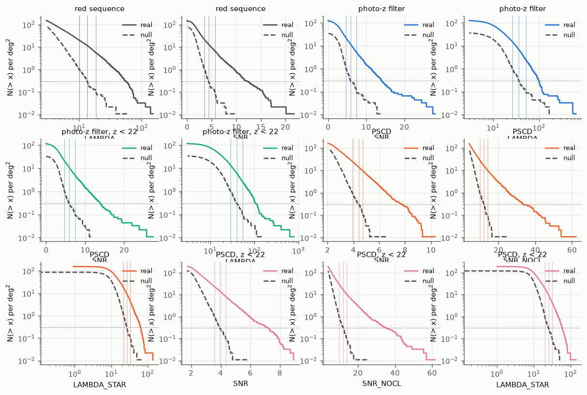
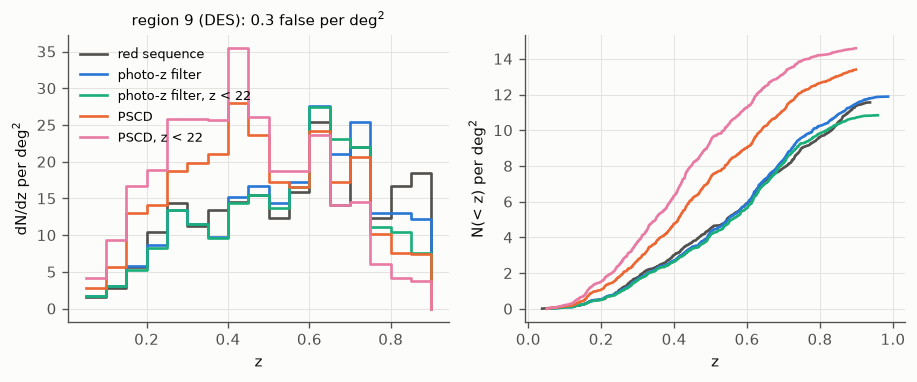
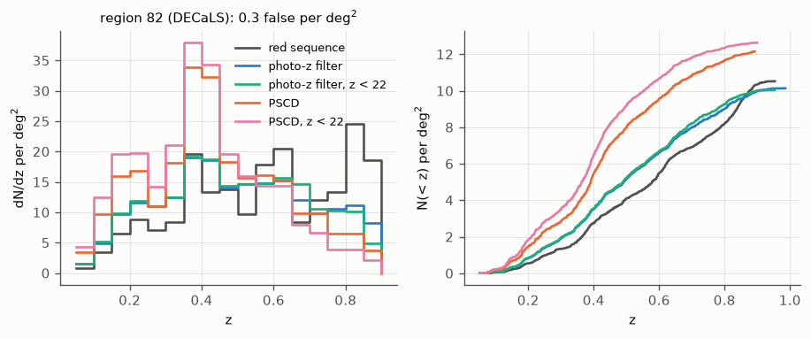
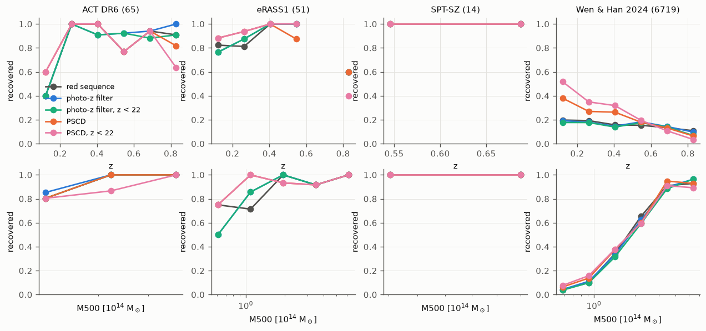
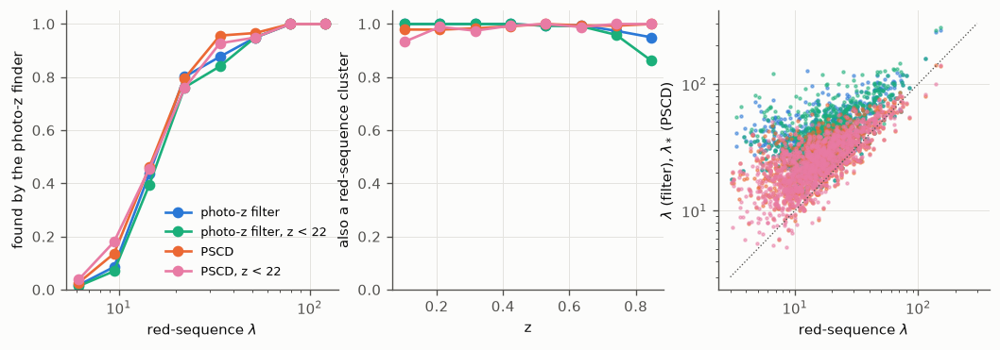
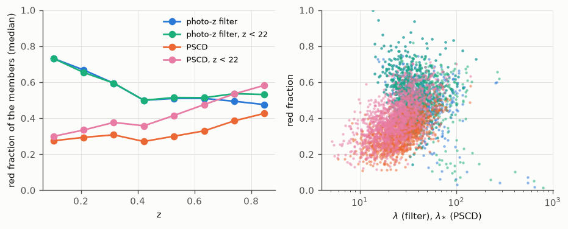
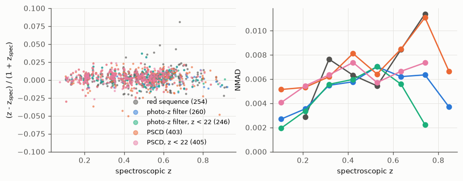
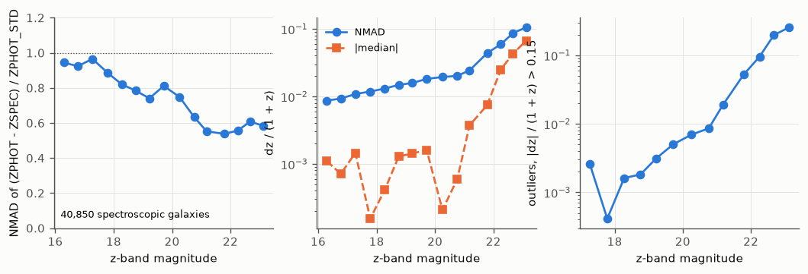

Photo-z cluster finding on DR11
===============================

The DR11 south catalogue finds clusters with redMaPPer's red-sequence filter: a galaxy is a
member candidate when its colours match the red sequence at the cluster redshift. Clusters
dominated by blue galaxies, poor groups and distant clusters, whose red sequence is faint in g
and r, are missed or found with a low richness. This page tests two ways of finding clusters from
the DR11 photometric redshifts instead, whatever the galaxies' colours, following the AMICO
matched filter (Bellagamba et al. 2018; Maturi et al. 2019):

- the **photo-z filter** of rema (``rema blind --set model.filter=photoz``): redMaPPer's
  machinery (seeds, λ, z_λ, percolation, centring on the brightest member) with the red-sequence
  colour term replaced by the galaxy's photo-z distribution;
- **PSCD** (Photo-z Space Cluster Detection, ``rema pscd``): an implementation of the AMICO
  method, an optimal linear filter on a three-dimensional grid of positions and redshifts with
  iterative extraction and cleaning of the detections.

They run on the same galaxies as the red-sequence finder, and every one is compared with its
own **null test** (the galaxies' photo-z, or colours, shuffled among galaxies of the same
magnitude), which sets its detection threshold at a matched false-detection rate. The test areas
are the 75 deg² strip of the development runs and two regions of the production plan, one in DES
(deep) and one in DECaLS (shallow).

**In short:** at the same false-detection rate, PSCD finds 10–40 % more clusters than the
red-sequence finder, mostly at z < 0.5, poor systems rich in blue members, and recovers more of
the low-mass clusters of Wen & Han (2024); the photo-z filter finds no more than the red
sequence. Neither improves the completeness at z > 0.6: the DR11 photo-z of the faint members are
too broad. Almost every photo-z detection is also a (low-λ) red-sequence cluster.

All the findings of the study, with the numbers of every run, the issues found and fixed and the
open questions, are collected on :doc:`photoz_study_findings`.

.. contents::
   :local:
   :depth: 1

Findings
--------

The three finders ran on the same galaxies in three areas: the strip (RA 0–5°, Dec −15–0°,
DECaLS depth; 37.4 deg² in the own box), region 9 of the production plan (RA 15–30°, Dec −55 to
−45°, DES depth; 92.0 deg²) and region 82 (RA 140–150°, Dec 5–15°, DECaLS; 92.8 deg²). Every
comparison below is made at the same false-detection rate, set by each finder's null test: **0.3
false detections per deg²**, where all the finders have an estimated purity of 97–98 %.

1. PSCD finds 10–40 % more clusters than the red sequence
~~~~~~~~~~~~~~~~~~~~~~~~~~~~~~~~~~~~~~~~~~~~~~~~~~~~~~~~~

Each finder is thresholded on its best statistic at 0.3 false detections per deg²:

.. list-table::
   :header-rows: 1
   :widths: 24 19 19 19 19

   * - area
     - red sequence (SNR)
     - photo-z filter (SNR)
     - PSCD (SNR_NOCL)
     - PSCD, z < 22
   * - strip
     - 522
     - 469
     - 728
     - 743
   * - region 9 (DES)
     - 1,214
     - 1,093
     - 1,462
     - 1,472
   * - region 82 (DECaLS)
     - 1,114
     - 941
     - 1,230
     - 1,309

**PSCD has 39–42 %, 20–21 % and 10–18 % more clusters than the red sequence** on the strip,
region 9 and region 82. With AMICO's own S/N (which includes the clusters' shot noise) the gain is
smaller: 659, 1,232 and 1,128 clusters. The photo-z filter does not beat the red sequence: it
has 10–15 % fewer detections than the red sequence thresholded on its SNR, and about as many as
the red sequence thresholded on λ (1,093 against 1,063 in region 9). For the red sequence, the null-calibrated
λ threshold is 12.7 on the strip and 13.6 in DES, but 18.6 in region 82: in shallow DECaLS data
the red-sequence finder makes more false detections at fixed λ, which agrees with the excess of
λ ≥ 20 clusters in shallow areas of the production catalogue.

   Region 9: cumulative density of detections against each finder's statistics, for the real
   galaxies (solid) and the null test (dashed: colours shuffled for the red sequence, photo-z for
   the others). The vertical lines are the thresholds at 0.1, 0.3 and 1 false detections per
   deg² (dotted line: 0.3). Strip and region 82: ``null_strip.png``, ``null_0082.png``.

2. The gain is at low redshift, not at high redshift
~~~~~~~~~~~~~~~~~~~~~~~~~~~~~~~~~~~~~~~~~~~~~~~~~~~~

PSCD's extra clusters are at **z < 0.5**, where it finds about twice as many as the red sequence
between z = 0.1 and 0.45. Above z = 0.6 it finds fewer, even in DES (401 against 519 at z > 0.6
in region 9, with each finder's default statistic) and the cut at z = 22 (PSCD, z < 22) removes
another quarter of them. The photo-z filter is the best photo-z finder at high z in DES (552
clusters at z > 0.6 in region 9, against 519 for the red sequence) but not in DECaLS (327 against
469 in region 82). There the red sequence has a peak at z = 0.8–0.9, which comes from its known
spike of z_λ at 0.82–0.86 and from its impurity in shallow data (the null test calibrates the
whole redshift range at once, not each redshift).

The DR11 photo-z are the limitation: fainter than z = 21 the photo-z scatter is 0.03–0.08 (1 + z)
with 3–14 % outliers, and at z > 0.6 most members of a cluster are that faint.

   Region 9 (DES): redshift distribution (left) and cumulative density (right) of each finder's
   clusters at 0.3 false detections per deg², with the default statistics (λ for the red
   sequence, SNR for the photo-z filter, AMICO's SNR for PSCD).

   The same in region 82 (DECaLS). Strip: ``counts_strip.png``.

3. More low-mass clusters, the same massive ones
~~~~~~~~~~~~~~~~~~~~~~~~~~~~~~~~~~~~~~~~~~~~~~~~

Against external catalogues (counterparts within 1 h⁻¹ Mpc and \|Δz\|/(1 + z) < 0.05):

- **SZ clusters:** every finder recovers 85–93 % of the ACT DR6 clusters in the own boxes (15, 65
  and 92) and all 14 SPT-SZ clusters of region 9.
- **eRASS1** (PCONT < 0.5): 84 % for the red sequence and the photo-z filter, 88 % for PSCD in
  region 9; 78–82 % for all in region 82 (51 clusters each).
- **Wen & Han 2024** (DESI Legacy Surveys clusters down to M500 ≈ 0.5 × 10¹⁴ M☉): PSCD recovers
  17–25 % of them against 13–18 % for the red sequence, and **38–64 % against 13–20 % at
  z < 0.2**. Above M500 = 3 × 10¹⁴ M☉ all the finders recover most of them (75–100 %).

   Region 9: fraction of the external clusters recovered by each finder at 0.3 false detections
   per deg², against redshift (top) and M500 (bottom). Strip and region 82:
   ``external_strip.png``, ``external_0082.png``.

4. The photo-z finders re-rank, they do not find new systems
~~~~~~~~~~~~~~~~~~~~~~~~~~~~~~~~~~~~~~~~~~~~~~~~~~~~~~~~~~~~

**97–99 % of the photo-z detections are also red-sequence clusters** (λ ≥ 3, within 1 h⁻¹ Mpc and
\|Δz\|/(1 + z) < 0.05). The extra clusters of PSCD are red-sequence systems of low λ (5–15) whose
blue members make them significant; conversely, the photo-z finders keep 85–92 % of the
red-sequence clusters with λ ≥ 20 in the strip and in DES, and 64–69 % in region 82.

The colour-blind membership is visible in the members: the probability-weighted fraction of
members on the red sequence (χ² < 9) has a median of 0.32–0.41 for PSCD and 0.51–0.56 for the
photo-z filter, whose members are bright (m* + 1.75).

   Region 9: fraction of the red-sequence clusters found by each photo-z finder against
   their λ (left), fraction of each photo-z finder's clusters that are red-sequence clusters
   (middle), and the richness of the matches (right).

   Region 9: median red fraction of the members against redshift (left) and against richness
   (right, one point per cluster).

5. Redshifts as good as the red sequence's
~~~~~~~~~~~~~~~~~~~~~~~~~~~~~~~~~~~~~~~~~~

Against the spectroscopic redshifts of the clusters (from the velocity clipping of their
spectroscopic members, or the central's), the scatter is **0.0057–0.0075 (1 + z)** for every finder
on the strip (0.0072 for the red sequence) and 0.0070–0.0074 in region 82, with offsets of
+0.003 to +0.005 (no correction is applied to the photo-z finders). Region 9 has no
spectroscopic redshifts in the DR11 photo-z sweeps.

   Strip: cluster redshift against spectroscopic redshift for the clusters at 0.3 false
   detections per deg² (left) and its NMAD (right). Region 82: ``redshift_0082.png``.

6. Practicalities
~~~~~~~~~~~~~~~~~

- The photo-z width calibration of the strip holds in region 82 (78,790 spectroscopic galaxies:
  scales 0.86, 0.75, 0.68, 0.56, 0.61 from z = 18 to 22.4, against 0.85, 0.76, 0.68, 0.55, 0.59).
- The cut at z = 22 (V1) gives the same counts at z < 0.6, fewer at z > 0.6, and no purity gain:
  the width weighting already discounts the faint photo-z.
- Run times on the strip (75 deg² with its buffer, 3.5 million galaxies), on the laptop: photo-z
  filter 16 min on its RTX 3060 (67,081 candidates after the significance floor, against 176,136
  for the red sequence, which took 41 min with the CPU shared with other jobs), PSCD 14 min on
  its CPU (a 505 × 1512 × 88 cube, 12,192 detections). At CC-IN2P3, on the regions (6.8 and 11.4
  million galaxies): photo-z filter 21–25 min on a V100 (171,000–197,000 candidates; red
  sequence: 59–60 min, 401,000–643,000 candidates), PSCD 14–17 min on 8 htc cores (28,000–34,000
  detections), with peaks of 6–9 GB of memory.

How the finders work
--------------------

Galaxy photo-z
~~~~~~~~~~~~~~

The galaxy tables carry the photo-z of the DR11 photo-z sweeps (Zhou et al. 2021, 2023):
``ZPHOT`` = Z_PHOT_MEDIAN_I and ``ZPHOT_STD`` = Z_PHOT_STD_I. Both finders take the photo-z of
a galaxy as a Gaussian of mean ZPHOT and width

    s = max(err_scale(m) ZPHOT_STD, err_floor (1 + ZPHOT)),

with ``err_floor`` = 0.01 (as Euclid Q1). On the strip's 40,850 spectroscopic galaxies,
ZPHOT_STD is too large: the robust width of (ZPHOT − ZSPEC)/ZPHOT_STD is 0.85 at z < 19 and
0.55–0.59 fainter than z = 21. ``err_scale`` is that width, interpolated in magnitude
(``scripts/photoz/photoz_dr11.yaml``, fitted by ``scripts/photoz/fit_errscale.py``,
:func:`rema.validate.photoz.fit_err_scale`). The predictions are cross-validated, so the
spectroscopic galaxies give a fair estimate for galaxies like them; they are bright and mostly
red, and the outliers (\|dz\|/(1+z) > 0.15: 0.1 % at z < 19, 3 % at 21–22, 14 % fainter) are
not modelled.

   DR11 photo-z against the spectroscopic redshifts of the strip, in bins of z-band magnitude:
   the robust width of (ZPHOT − ZSPEC)/ZPHOT_STD (left), the scatter and offset of
   dz/(1 + z) (middle) and the outlier fraction (right).

The field (noise)
~~~~~~~~~~~~~~~~~

Both finders compare a cluster with the field, the stacked photo-z distributions of the region's
own galaxies (:func:`rema.model.background.build_photoz_bkg`):

    Σ_pz(z, m) = N(m) P(z | m),

the density of galaxies per deg², per magnitude and per unit redshift, with N(m) the counts over
the footprint's effective area of the data box and P(z | m) the mean photo-z distribution of the
galaxies of magnitude m (kernel-smoothed in magnitude where galaxies are few). It is AMICO's
noise N(m, z_c); when the photo-z distributions are posteriors with the field population as
prior, the ratio p_i(z)/Σ_pz is the Bayesian membership odds. Σ_pz does not depend on the
cosmology and is measured per region, so it follows the region's depth.

The photo-z filter
~~~~~~~~~~~~~~~~~~

In the richness solve (:mod:`rema.core.richness`), the colour weight ρ(χ²) and the χ²
background Σ_g(z, χ², m) are replaced by

    u_i = 2π r_i Σ_NFW(r_i) φ(m_i)/lumnorm · p_i(z),   b_i = 2π r_i Σ_pz(z, m_i) / D(z)²,

with p_i(z) = N(z; ZPHOT_i, s_i), and members within ``photoz.nsig_max`` = 4 s_i of z. The rest
of the solve, the mask and depth completeness K, z_λ (whose likelihood becomes Σ w_i ln p_i(z))
and the percolation are redMaPPer's. The differences from the red-sequence runs:

- seeds are galaxies of any colour brighter than m*(ZPHOT) + 1 with s/(1 + ZPHOT) < 0.1;
- most seeds reach λ ≥ 3, because the photo-z window is much wider than the red sequence:
  candidates also need ``richness.min_lnlamlike`` = 4.5 (a local significance
  SNR = √(2 LNLAMLIKE) ≥ 3) after the first pass and the likelihood pass;
- clusters are centred on their brightest member (BCG); wcen and LNCGLIKE are calibrated on
  zred, and there is no red-sequence z_λ correction;
- variant V1 adds ``photoz.mag_max`` = 22: only galaxies brighter than z = 22, where the DR11
  photo-z are reliable, are members, and the completeness K includes the cut.

The catalogue gets SNR (for every filter), the central's and the members' ZPHOT, ZPHOT_STD and
ZPHOT_E, and the members' CHISQ_RS, their red-sequence χ² at the cluster redshift.

PSCD (AMICO)
~~~~~~~~~~~~

PSCD (:mod:`rema.pscd`) follows Bellagamba et al. (2018) and Maturi et al. (2019). The data
D(θ, m, z) are modelled as A M_c(θ − θ_c, m) q(z_c, z) + N(m, z), with the cluster template of
KiDS (an NFW profile with c = 3.59 and R200 = 1 Mpc, truncated at 1.35 R200, times a Schechter
function of slope −1.06 around m*(z), with 22.9 galaxies brighter than m* + 2 within R200) and
the field N = Σ_pz. On a grid of 0.01° pixels (gnomonic projection of the region) and redshift
slices of 0.01, the optimal filter gives

    S(θ_c, z_c) = Σ_i M_c(θ_i − θ_c, m_i) p_i(z_c) / N(m_i, z_c),
    A = (S − β)/α,   σ_A² = 1/α + A γ/α²,   L = L0 + A² α,

where α = ∫M_c² q²/N, β = ∫M_c and γ = ∫M_c³ q³/N² run over the unmasked area of the footprint
and down to the local depth (with the q statistics of Gaussian photo-z: ⟨p_i(z_c)⟩ =
1/(2√π s) for a member). Detections are taken one at a time at the cell of highest likelihood;
the membership probabilities of the galaxies around it,

    P(i ∈ j) = P_f,i A_j M_j p_i(z_j) / (A_j M_j p_i(z_j) + N(m_i, z_j)),

reduce their field probabilities P_f,i, and their contributions are removed from S (the
cleaning) before the next detection. The catalogue gives the amplitude A (1 for the template:
M200 ≈ 10¹⁴ M☉/h), AMICO's S/N = A/σ_A, which includes the cluster's own shot noise, SNR_NOCL =
A√α against the background only, LAMBDA = Σ P(i ∈ j), LAMBDA_STAR (members brighter than
m* + 1.5 within R200), the redshift of the peak and its members' photo-z error, and the
brightest member with P > 0.5. The detections are extracted down to SNR_NOCL = 4 and the
thresholds are set afterwards by the null tests.

Differences from AMICO:

- the photo-z distributions are Gaussians (DR11 gives no full p(z));
- the NFW template has a flat core within 0.1 h⁻¹ Mpc, as rema's radial filter: with a cusp
  narrower than the pixels, the amplitude of mock clusters came out up to 35 % low at z = 0.85;
- no local background correction f(θ, z) (Bellagamba et al. 2018, Sect. 2.6) and no BCG term;
- the depth enters through the local magnitude limit of the footprint (5σ in the z band).

On mocks drawn from the template, the amplitude is unbiased (A = 1.95 ± 0.05, 2.01 ± 0.08,
1.85 ± 0.09 for an input A = 2 at z = 0.3, 0.7, 0.85) and its scatter is the predicted σ_A.

Null tests and matched thresholds
~~~~~~~~~~~~~~~~~~~~~~~~~~~~~~~~~

The three finders have different detection statistics (λ, SNR, A, λ*). Each one is run a second
time on the same galaxies with ``null.shuffle`` (:mod:`rema.validate.null`):

- ``photoz`` for the photo-z finders: the (ZPHOT, ZPHOT_STD) pairs are permuted among galaxies of
  the same magnitude (0.1 mag bins). Real structures keep their angular overdensity but lose their
  redshift coherence;
- ``colour`` for the red-sequence finder: the fluxes are permuted the same way, each rescaled to
  the galaxy's own reference flux, which erases the red sequence.

The threshold of a statistic is the value above which the null run has a given number of
detections per deg² of the own box (0.1, 0.3 or 1): the finders are compared at the same false
rate. The null keeps the angular clustering of the galaxies, so it counts chance alignments and
projections, but not the false detections made of real structures at the wrong redshift.

Assumptions and limits
----------------------

- The photo-z widths are calibrated on spectroscopic galaxies, which are brighter and redder
  than most cluster members; faint blue members probably have wider and more often catastrophic
  photo-z than assumed.
- A colour-blind richness counts the blue members: λ of the photo-z filter and λ* of PSCD are not
  redMaPPer's λ, and the mass–richness relations of redMaPPer do not apply to them.
- The z errors of the photo-z finders come from the members' photo-z and treat their errors as
  independent; they are too small where the photo-z errors are correlated.
- The null tests measure false detections from the galaxy distribution itself; the purity of
  the faint detections also depends on projections of real structures, which only mocks with
  realistic large-scale structure (SinFoniA in AMICO's case) would measure. The thresholds are
  set over the whole redshift range: a finder with more false detections at high z (the red
  sequence in shallow data) gets a higher threshold everywhere.
- Region 9 has no spectroscopic redshifts in the DR11 photo-z sweeps: its photo-z widths use the
  strip's calibration, which region 82 confirms, and its redshifts are not checked.
- Three areas of 37–93 deg² each: the external samples are small (14–92 SZ and X-ray clusters
  per area).

Reproduce
---------

On the laptop (the strip; about 3 h with a GPU), in a Python environment with a working jaxlib:

.. code-block:: bash

   PY=python scripts/photoz/photoz_strip.sh          # every variant: blind, pscd, null tests

At CC-IN2P3 (regions 9 and 82):

.. code-block:: bash

   source $REMA/scripts/slurm/ccin2p3.env
   $REMA/scripts/photoz/photoz_test.sh prepare        # galaxy tables and footprints
   $REMA/scripts/photoz/photoz_test.sh run            # the variants and the photo-z width fits
   $REMA/scripts/photoz/photoz_test.sh status

then copy ``$OUTDIR/runs/<variant>/<region>/clusters.fits`` to ``$REMA_PHOTOZ/<region>/<variant>/``
with the regions' footprints, and make the figures:

.. code-block:: bash

   python docs/figures/photoz_finders/make_all.py

References
----------

- Bellagamba F., Roncarelli M., Maturi M., Moscardini L., 2018, MNRAS 473, 5221, *AMICO:
  optimized detection of galaxy clusters in photometric surveys* (arXiv:1705.03029).
- Maturi M., Bellagamba F., Radovich M. et al., 2019, MNRAS, *AMICO galaxy clusters in KiDS-DR3:
  sample properties and selection function* (arXiv:1810.02811).
- Bellagamba F., Sereno M., Roncarelli M. et al., 2019, MNRAS, *AMICO galaxy clusters in
  KiDS-DR3: weak-lensing mass calibration* (arXiv:1810.02827).
- Euclid Collaboration: Adam R. et al., 2019, A&A, *Euclid preparation III. Galaxy cluster
  detection in the wide photometric survey, performance and algorithm selection*
  (arXiv:1906.04707).
- Maturi M., Radovich M., Moscardini L. et al., 2025, A&A 701, A201, *AMICO galaxy clusters in
  KiDS-1000: cosmological sample* (arXiv:2507.14338).
- Euclid Collaboration: Bhargava S. et al., 2025, A&A, *Euclid Quick Data Release (Q1). First
  detections from the galaxy cluster workflow* (arXiv:2503.19196).
- Zhou R., Newman J. A. et al., 2021, MNRAS 501, 3309, *The clustering of DESI-like luminous red
  galaxies using photometric redshifts* (arXiv:2001.06018); Zhou R., Ferraro S., White M. et al.,
  2023, JCAP 11, 097, *DESI luminous red galaxy samples for cross-correlations*
  (arXiv:2309.06443), which released the photo-z of the DR9-DR11 photo-z sweeps.
- Wen Z. L., Han J. L., 2024, ApJS, *A catalog of 1.58 million clusters of galaxies identified
  from the DESI Legacy Imaging Surveys* (arXiv:2404.02002).
- Zou H., Gao J., Xu X. et al., 2021, ApJS, *Galaxy clusters from the DESI Legacy Imaging
  Surveys. I. Cluster detection* (arXiv:2101.12340).
