redMaPPer blind mode on DR11
============================

This page shows the DR11 south production catalogue of rema (blind mode, version 0.2.0) in the
figures of the redMaPPer papers: the SDSS DR8 catalogue of Rykoff et al. (2014, R14), the DES
Science Verification catalogue of Rykoff et al. (2016, R16), the Legacy Surveys DR10 runs of
Kluge et al. (2024, K24), and later papers that validated redMaPPer catalogues against
spectroscopy, X-ray, SZ and other optical catalogues (list at the end). Each caption names the
figure it reproduces. The scripts that make the figures, and a notebook built from them, are
described under `Reproduce`_.

.. note::

   The figures were made on 2026-10-07 from the first part of the run (RA 0–240°, 13,141 deg²,
   2.45 million clusters at λ ≥ 3, 48 million members with P ≥ 0.05). The second part (RA
   240–360°) was still running; the scripts read it as soon as it is next to the first one.

Catalogue and footprint
-----------------------

- **Catalogue.** ``clusters_dr11.fits`` and ``clusters_dr11_members.fits`` of the production run
  (:doc:`ccin2p3`): blind mode with one red-sequence calibration in g, r, i, z (z-band
  reference), clusters with λ ≥ 3 and MASKFRAC ≤ 0.2.
- **Footprint.** The DR11 randoms cut like the galaxies (mask bits, at least one exposure in g,
  r, i and z, E(B−V) < 0.2), at \|b\| ≥ 15°, inside the own boxes of the regions that finished.
  The area quoted below is the number of such randoms over their density (2500 per deg² in one
  randoms file).
- **Seams.** The two parts of the run meet at RA 0° and 240° and at Dec −85°; within 2.33° of
  these lines λ may be low (the data of a cluster stop at the seam). The figures keep these
  clusters.
- **Calibration area.** The red-sequence model and the z_λ correction were trained on the
  spectroscopic redshifts of RA 160–180° and 190–210°, Dec −10° to 10°. The redshift
  statistics are therefore given outside this area ("independent") and inside it separately.
- **Spectroscopic redshifts.** They come with the DR11 photo-z sweeps (``Z_SPEC``: SDSS, BOSS,
  eBOSS, DESI, GAMA and others; COSMOS2015 photo-z excluded). The spectroscopic post-processing
  (Clerc et al. 2016 clipping) gives each cluster ``SPEC_Z_BOOT``, ``VDISP_BOOT`` and the redshift
  of its central galaxy ``CG_SPEC_Z``.

Numbers
-------

The table collects the numbers measured in the figures below, next to the values published for
other redMaPPer catalogues. λ is the rema richness in g, r, i, z, not normalised to any other
filter set (K24 quote λ_norm, normalised to grz; their griz λ is 1.039 λ_norm).

.. include:: figures/redmapper_dr11/values.rst

Red-sequence calibration
------------------------

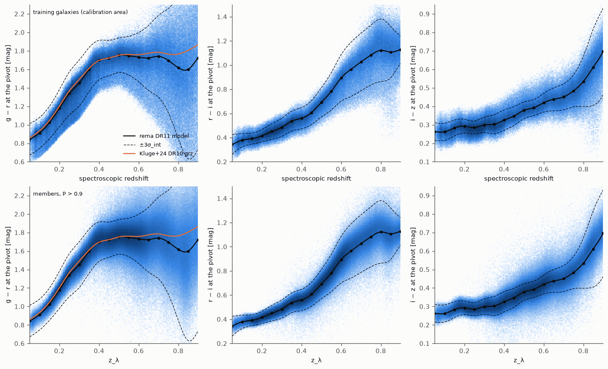

   Colour at the pivot magnitude against redshift (R14 Figs. 1 and 4; K24 Fig. C.1). Top: the
   spectroscopic training galaxies of the calibration area (m < m* + 1, χ² < 20). Bottom: the
   members with P > 0.9 of the whole catalogue at the z_λ of their cluster. Black: the rema model
   (nodes as dots, ±3σ_int dashed); orange: the DR10 grz model of K24 (g − r). The model follows
   the ridge of both samples in every colour; the 4000 Å break moves from g − r to r − i at
   z ≈ 0.35 and to i − z at z ≈ 0.7, where the corresponding colour flattens.

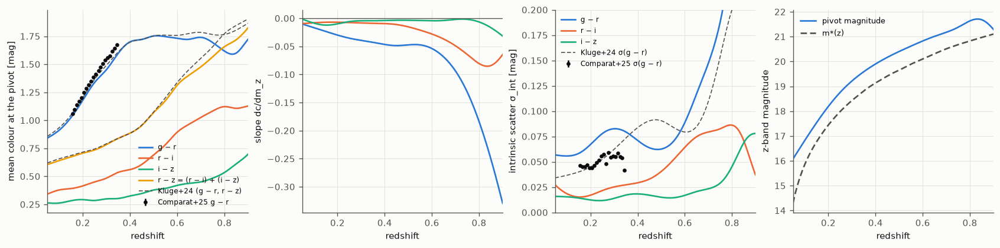

   Red-sequence parameters against redshift (R14 Fig. 5): mean colour at the pivot, slope, intrinsic
   scatter and pivot magnitude. The mean g − r and r − z agree with K24 within 0.04 mag below
   z ≈ 0.6; the g − r of Comparat et al. (2025, from cluster–galaxy cross-correlations) is 0.02–0.10
   mag redder, the difference growing with redshift. The intrinsic scatter of g − r (0.06–0.08 at z < 0.35) is larger than that of K24 and Comparat et
   al. (≈ 0.045); r − i and i − z are much tighter (0.01–0.03) where they carry the break.

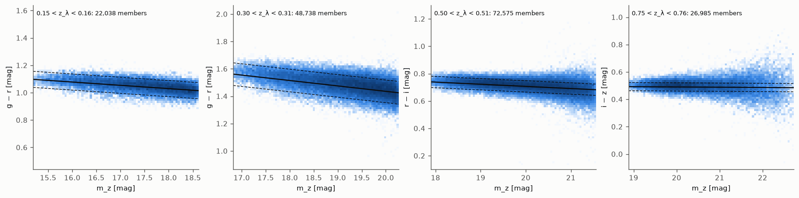

   Composite red sequences (R14 Fig. 3): members with P > 0.9 in slices of Δz_λ = 0.01, in the
   colour that straddles the 4000 Å break, with the model and ±1σ_int. The faint end is the
   luminosity cut of λ, m* + 1.75.

Cluster redshifts
-----------------

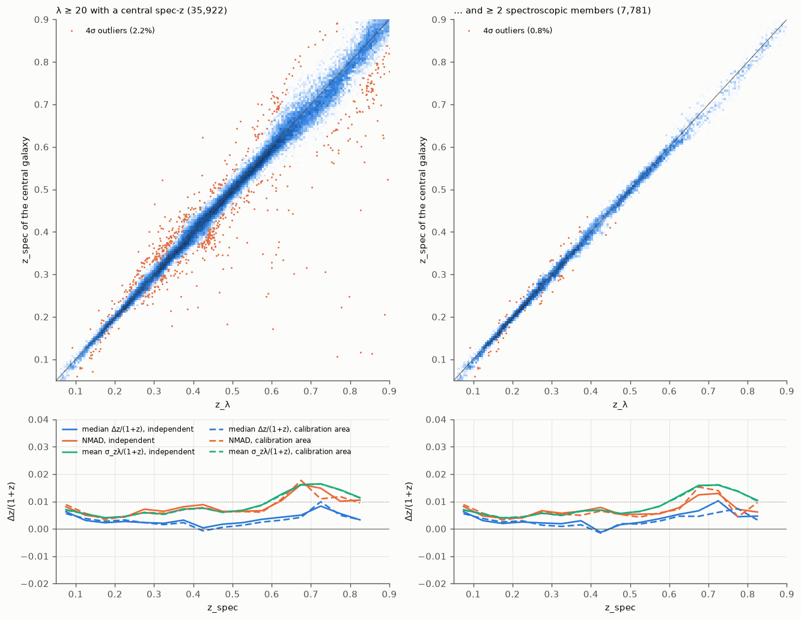

   z_λ against the spectroscopic redshift of the central galaxy for λ ≥ 20 (R14 Figs. 9–10; R16
   Figs. 4–5). Left: all clusters with a central spectroscopic redshift; right: those with at
   least two other spectroscopic members (P ≥ 0.8) within 1000 km/s of the central. Orange dots
   are 4σ outliers. Bottom: median Δz/(1+z), NMAD and the mean formal error σ_zλ/(1+z), outside
   the calibration area (solid) and inside (dashed); the dotted line is σ_z/(1+z) = 0.01. The
   scatter is 0.005–0.008 below z = 0.6 and rises to ≈ 0.015 at z ≈ 0.7, where the break leaves
   the r band; the formal errors follow it. Most outliers are clusters whose central galaxy is
   a foreground or background galaxy (miscentring or projection); they mostly disappear in the
   clean sample. The calibration area and the rest of the sky have the same statistics.

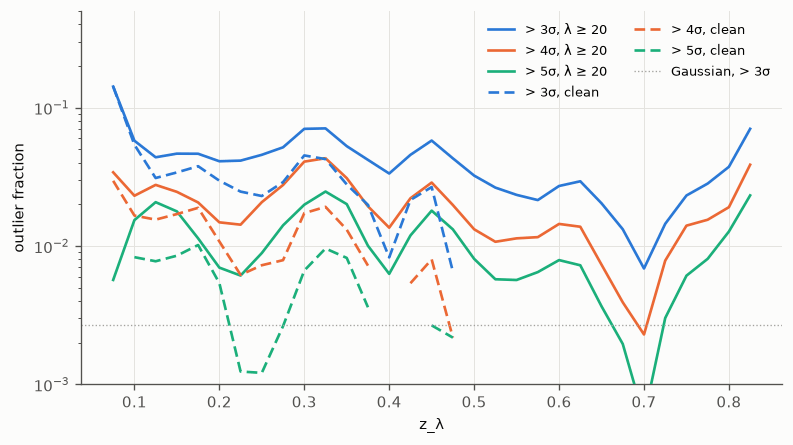

   Fraction of 3σ, 4σ and 5σ outliers against z_λ (R14 Fig. 11), for λ ≥ 20 (solid) and the clean
   sample (dashed), outside the calibration area. The 4σ fraction is 1–4%, about twice that of
   SDSS DR8 (R14, R16), and peaks near z ≈ 0.3 and 0.45. In the clean sample it is about 1%,
   half that of the full sample.

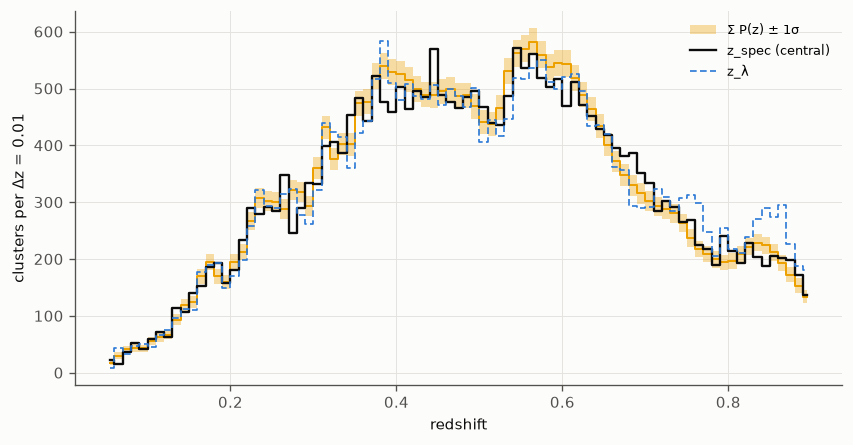

   Redshift distribution of the clusters with λ ≥ 20 and a central spectroscopic redshift (R14
   Fig. 12): z_spec (black), z_λ (blue) and the sum of the P(z) (yellow, with the Poisson band). The
   summed P(z) follows the z_spec histogram more closely than z_λ, whose histogram has spikes
   (e.g. at 0.38) and an excess at 0.8–0.87; the χ² of the comparison (table) is still about 2.5 per
   bin, so the P(z) are somewhat too narrow or slightly biased at some redshifts.

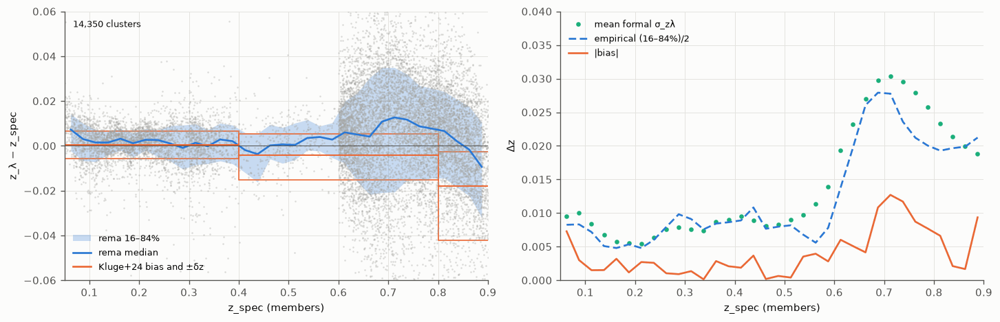

   z_λ against the velocity-clipped spectroscopic redshift of the members (K24 Figs. 16–17), with
   their member thresholds (≥ 10 members at z < 0.3, ≥ 7 at 0.3–0.6, ≥ 3 above), λ ≥ 10, outside the
   calibration area. Left: running median and 16–84% of z_λ − z_spec, with the bias and
   uncertainty of K24 in their four redshift ranges (orange boxes). Right: mean formal error,
   empirical uncertainty and absolute bias. Below z = 0.6 the bias is < 0.005 and the
   uncertainty 0.005–0.01, as in K24; at 0.6–0.8 both grow (uncertainty ≈ 0.025, bias ≈ +0.01).
   The formal errors match the empirical ones at all redshifts (ratio in the table).

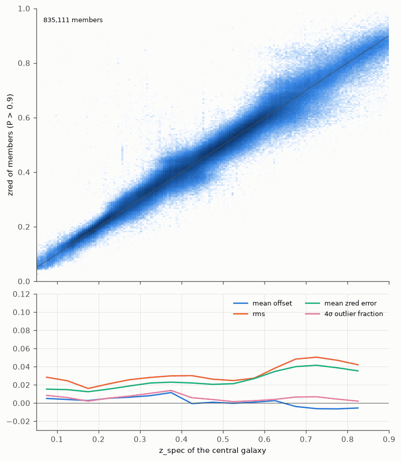

   zred of the members with P > 0.9 against the spectroscopic redshift of the central (R14 Fig. 7,
   after the zred correction), outside the calibration area. Bottom: mean offset, rms, mean zred
   error and 4σ outlier fraction. The offset stays within ±0.01; the rms is 0.02–0.03 below
   z = 0.6 and 0.04–0.05 above, slightly larger than the quoted errors. The flare-up at z ≈ 0.35–0.4
   (break between g and r) is the same as in R14.

Richness
--------

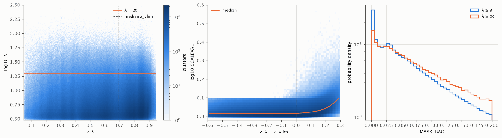

   Left: λ against z_λ (R14 Fig. 19). Middle: SCALEVAL against z_λ − z_vlim (R14 Fig. 27): below
   z_vlim it is set by the masked part of the aperture (up to 1/(1 − 0.2) = 1.25), above it rises
   as the depth cuts into the luminosity function. Right: MASKFRAC (K24 Fig. B.2). Poor clusters
   pile up at z_λ ≈ 0.85–0.9, close to the upper end of the calibration (z = 0.9).

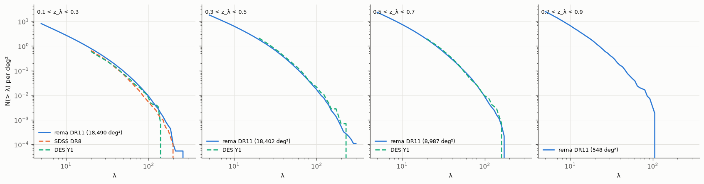

   Cumulative richness function N(> λ) per deg² in four bins of z_λ, in the sky where z_vlim is
   above the bin (area in the legend), with SDSS DR8 (R16) and DES Y1 redMaPPer (λ ≥ 20, their
   published areas). The rema function lies on DES Y1 from z = 0.3 to 0.7 and slightly above SDSS
   DR8 at z < 0.3.

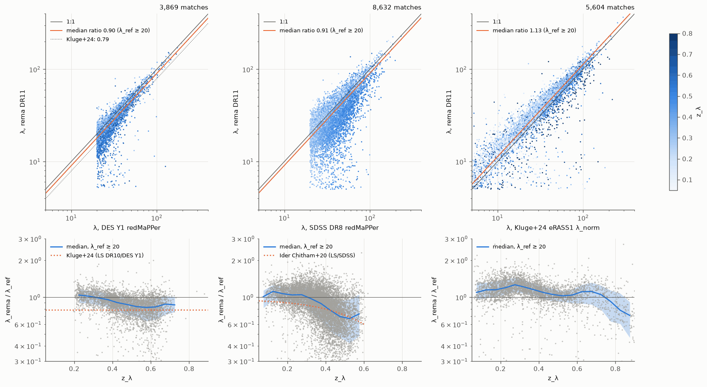

   λ of rema against the λ of DES Y1, SDSS DR8 and the eRASS1 λ_norm of K24 (K24 Fig. 11; DES Y3
   Fig. 3), for one-to-one matches within 1.5′ and \|Δz\|/(1+z) < 0.02 (MASKFRAC < 0.1), coloured by
   z_λ; bottom: the ratio against z_λ. rema λ is 0.90 times DES Y1 in the median (K24 found 0.79 for
   their DR10 λ_norm), from ≈ 1.05 at z = 0.2 to ≈ 0.85 at z = 0.6. Against SDSS the ratio drops above z = 0.3, where SDSS becomes
   too shallow, and follows the relation of Ider Chitham et al. (2020). rema λ is 13% above λ_norm
   (K24 run at the eRASS1 positions on DR10), 9% more than their griz/grz normalisation (1.039).

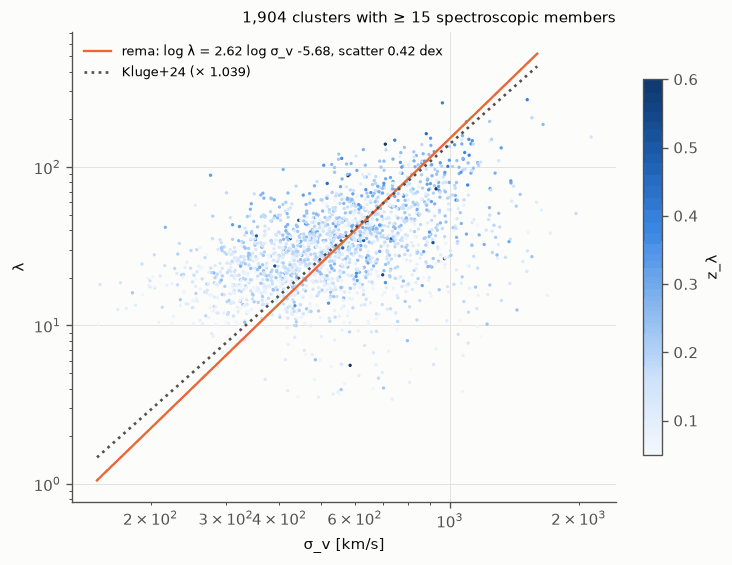

   λ against the velocity dispersion of clusters with at least 15 spectroscopic members (K24 Fig.
   18; Wetzell et al. 2022 Fig. 3), coloured by z_λ, with an orthogonal fit and the K24 relation.
   The slope is steeper than K24's (table) and the scatter larger (≈ 0.4 dex in λ): the blind
   catalogue includes projected systems, and the dispersions of poor clusters rest on few members.

Depth, volume limit and abundance
---------------------------------

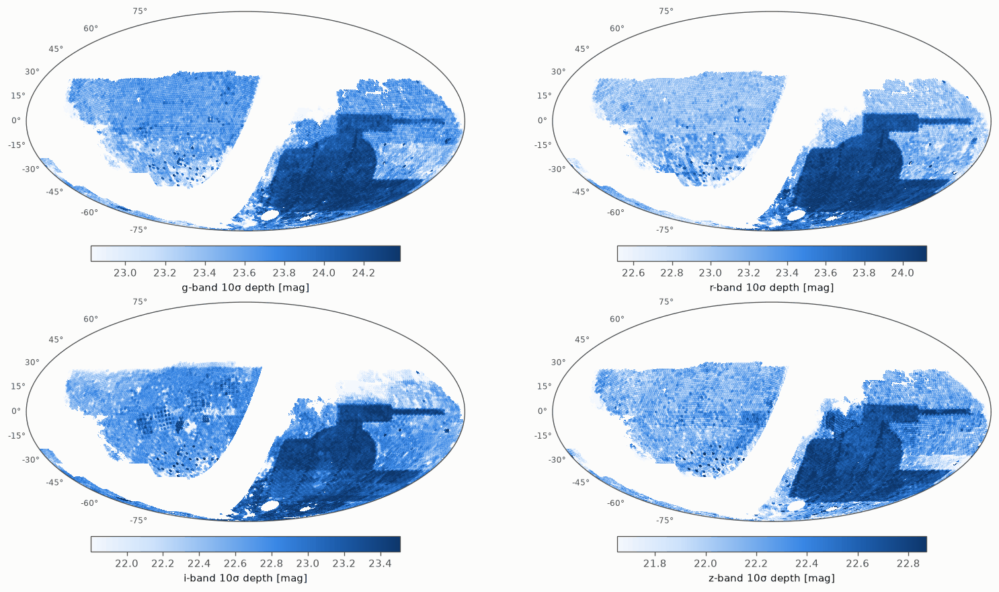

   10σ galaxy depth in g, r, i and z (extinction corrected), per NSIDE 256 pixel of the run
   footprint (R16 Fig. 1; K24 Figs. 2 and B.1). The DES area (Dec < 0°, RA ≲ 100°) is 0.5–1 mag
   deeper than the DECaLS area; the i band is the most inhomogeneous.

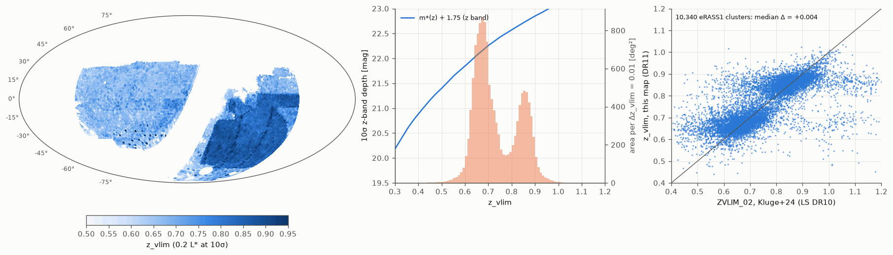

   z_vlim, the redshift where a 0.2 L* galaxy reaches the 10σ z-band depth (K24 Figs. 3 and B.3).
   Left: map; middle: the conversion m*(z) + 1.75 and the area per z_vlim (two peaks: DECaLS at
   ≈ 0.67, DES at ≈ 0.85); right: z_vlim of this map at the eRASS1 cluster positions against the
   ZVLIM_02 of K24 from the DR10 depth. The two agree on average (median difference in the
   table); the scatter comes from the different depth estimates (randoms per pixel here,
   local depth at each cluster in K24).

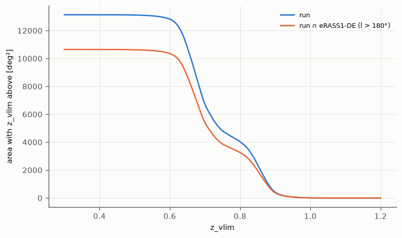

   Area of the run with z_vlim above a given redshift (K24 Fig. 3), in total and in the
   eRASS1-DE half of the sky (Galactic longitude > 180°). The catalogue is volume limited to
   z = 0.6 over almost the whole area and to z = 0.8 over a third of it.

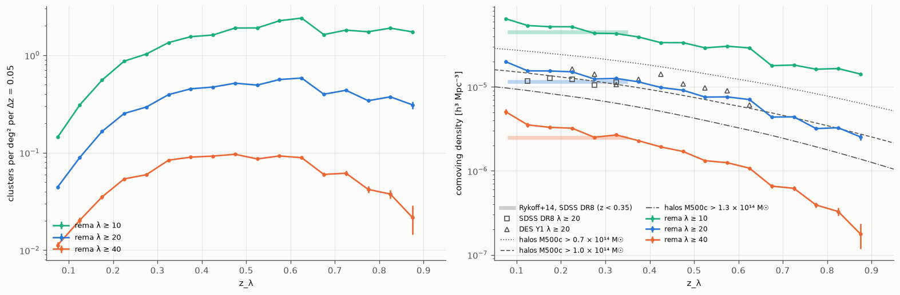

   Cluster density against z_λ for λ ≥ 10, 20 and 40, in the sky where z_vlim is above each bin
   (R14 Fig. 18; R16 Fig. 6; K24 Fig. 12). Left: per deg² and Δz = 0.05; right: comoving density,
   with the levels of SDSS DR8 below z = 0.35 (R14, bands), SDSS DR8 v6.3 and DES Y1 at λ ≥ 20
   (symbols) and the abundance of halos above M500c = 0.7, 1.0 and 1.3 × 10¹⁴ M☉ (Tinker et al.
   2008). The λ ≥ 20 density matches SDSS DR8 at z < 0.35 and lies 0–30% below DES Y1 at
   0.2 < z < 0.6; it falls between the halo abundances above 0.7 and 1.0 × 10¹⁴ M☉, as in R16. At
   z > 0.6 it decreases faster than the halo abundance at fixed mass.

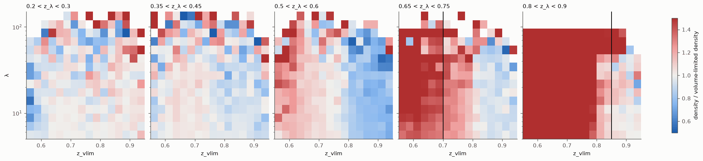

   Cluster density in the plane of z_vlim and λ, relative to the density in the volume-limited
   sky at the same λ, in five bins of z_λ (K24 Fig. 13). The vertical line is z_vlim = z_λ. Below
   z ≈ 0.45 the ratio is close to 1. At 0.5–0.6 the shallower sky (DECaLS, z_vlim ≈ 0.65)
   has ≈ 20% more clusters at fixed λ than the deeper DES area, although both are volume limited
   there: λ is not yet independent of the photometric depth at these redshifts. At z_λ above
   z_vlim (left of the line) the density rises sharply, as λ is extrapolated with SCALEVAL.

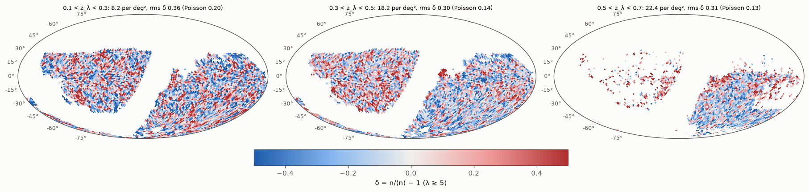

   Density contrast of the clusters with λ ≥ 5 in three bins of z_λ, on 3.4 deg² pixels where z_vlim
   is above the bin (R14 Fig. 17; R16 Figs. 2–3). The rms of δ (in the titles) exceeds the Poisson
   noise because of clustering and of the depth dependence above; no stripes or region
   boundaries stand out.

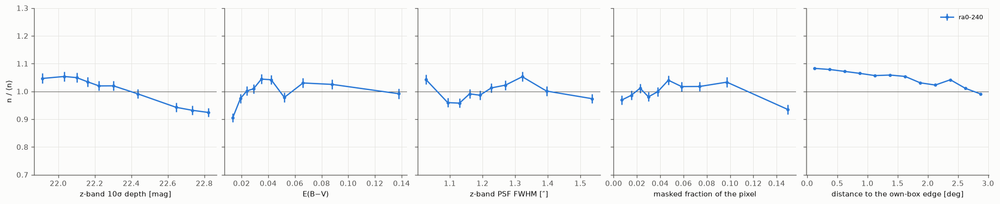

   Density of λ ≥ 20 clusters at 0.1 < z_λ < 0.5, in pixels with z_vlim > 0.5, against the z-band
   depth, E(B−V), z-band PSF size and masked fraction of the pixel (Baxter et al. 2016 Fig. 2), and
   against the distance to the edge of the region that found the cluster (QA of the merge). The
   density decreases by ≈ 12% from the shallowest to the deepest pixels (the DES area), the
   effect seen in the previous figures. The pixels of lowest extinction, mostly in the deep DES
   area, are 10% below the mean; the trend with seeing stays within ±5%, and the most masked
   pixels are 7% low.
   The edge profile, relative to points spread uniformly over the own boxes (which ignore the
   mask), rises by 8% towards the internal edges; part of the rise can come from the footprint
   geometry (the outer edges of the survey count as region interiors).

Centring
--------

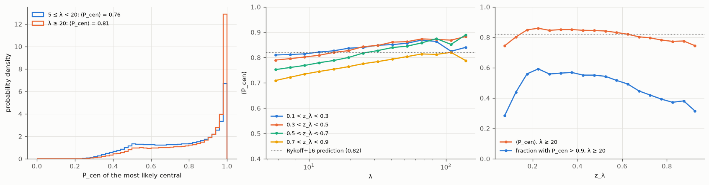

   Centring probability of the most likely central (R16 Sect. 8): distribution for 5 ≤ λ < 20 and
   λ ≥ 20, mean against λ in four redshift bins, and mean against z_λ for λ ≥ 20 with the fraction of
   clusters with P_cen > 0.9. ⟨P_cen⟩ = 0.82 for λ ≥ 20, as predicted for DES SV (R16); it rises
   with λ and decreases above z ≈ 0.6.

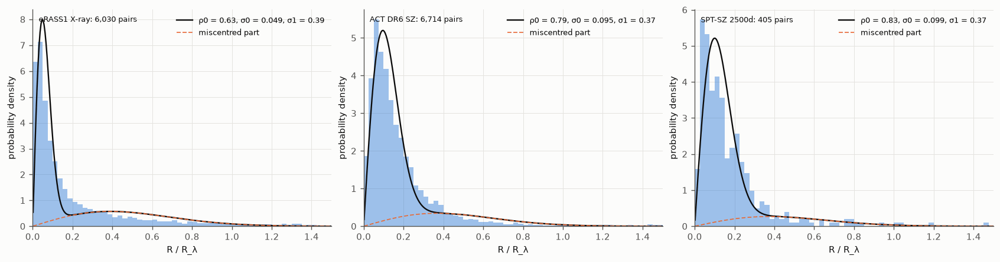

   Offsets between the rema centre and the eRASS1 X-ray, ACT DR6 SZ and SPT-SZ centres, in units of
   R_λ, with the two-component model of R16 (Figs. 11–12; Zhang et al. 2019 Fig. 3): a fraction
   ρ0 well centred (width σ0, the positional errors) and the rest miscentred (width σ1). With
   ACT and SPT, ρ0 = 0.79 and 0.86, within the 0.78 ± 0.11 of R16; σ1 ≈ 0.4 R_λ. The eRASS1 fit
   gives a lower ρ0 (0.63): its positional errors are tens of arcseconds, not a fixed fraction of
   R_λ, and spread the well-centred peak into the miscentred component.

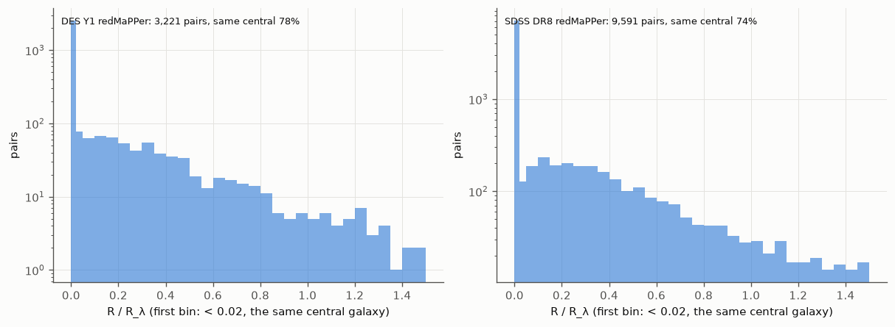

   Offsets between the rema centres and those of DES Y1 and SDSS DR8 redMaPPer (λ ≥ 20 in both;
   Zhang et al. 2019 Fig. 1). Three quarters of the clusters have the same central galaxy (first
   bin); the rest are spread to R_λ, the signature of a different choice among the candidates.

Comparison with SZ, X-ray and optical catalogues
------------------------------------------------

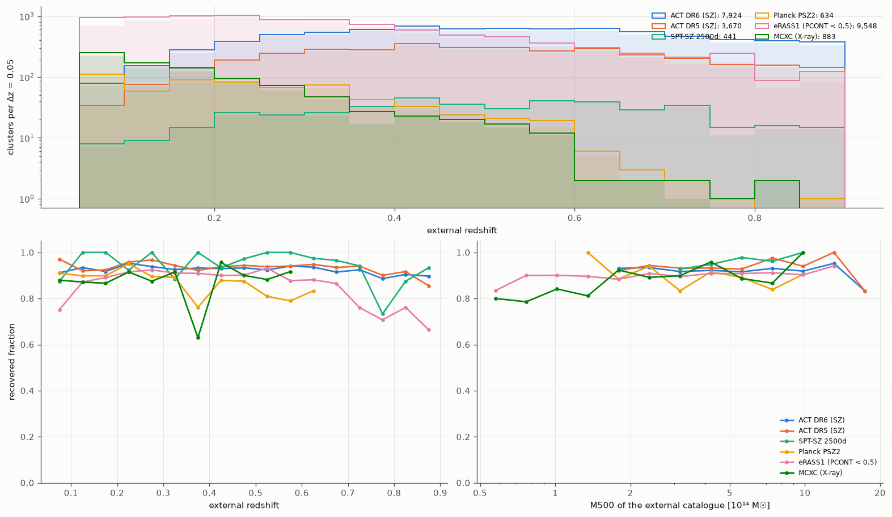

   Recovery of external clusters in the footprint (K24 Fig. 10; Rozo & Rykoff 2014 Fig. 4): a
   rema cluster with λ ≥ 5 within 1 h⁻¹ Mpc and \|Δz\|/(1+z) < 0.05. Top: redshift distributions
   (lines) and recovered clusters (filled); bottom: recovered fraction against redshift and
   mass. 93–96% of the ACT and SPT clusters are recovered at all redshifts; Planck PSZ2, MCXC and
   eRASS1 reach 87–88%. The eRASS1 recovery drops below z = 0.1, above z = 0.7 and below
   M500 ≈ 2 × 10¹⁴ M☉. K24 found > 95% in scan mode, where the external position and redshift are
   given.

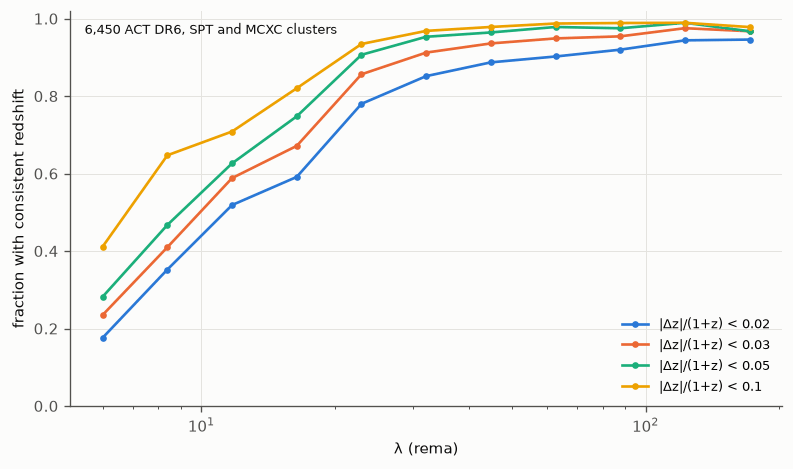

   Fraction of ACT DR6, SPT and MCXC clusters whose rema counterpart (matched by position) has a
   consistent redshift, for tolerances 0.02–0.10 in \|Δz\|/(1+z), against λ (K24 Fig. 7). Above
   λ = 20, 88% agree within 0.02 and 96% within 0.05; below, the counterpart is often a
   projected poor system at another redshift.

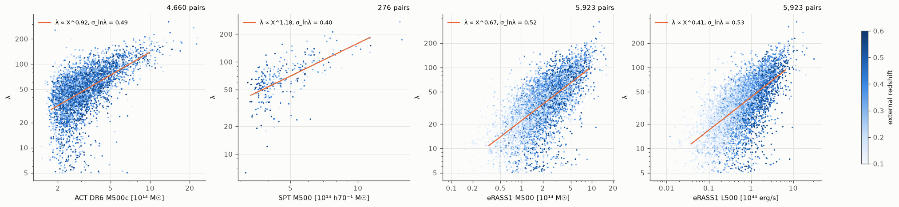

   λ against the SZ masses of ACT DR6 and SPT, the eRASS1 masses and the eRASS1 luminosity L500
   (Rozo et al. 2015 Fig. 2; Saro et al. 2015 Fig. 4; Bleem et al. 2020 Fig. 9), for 0.1 < z < 0.6,
   with a least-squares fit of ln λ on the mass proxy; the slopes and scatters are in the
   legends. The scatter (σ_lnλ ≈ 0.4–0.5) includes the measurement errors of both quantities and
   the outliers below the relation (projections and wrong counterparts).

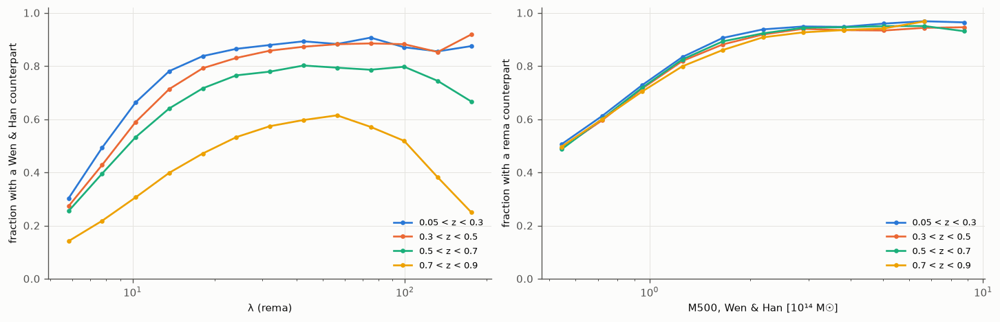

   Cross-identification with the 1.58 million clusters of Wen & Han (2024) in the Legacy Surveys
   (their Fig. 10; Zou et al. 2021 Fig. 9). Left: fraction of rema clusters with a Wen & Han
   counterpart against λ; right: fraction of Wen & Han clusters with a rema counterpart against
   their mass. Both reach 90–95% for rich clusters (λ ≳ 30, M500 ≳ 2 × 10¹⁴ M☉) below z = 0.7.
   At 0.7 < z < 0.9 only 50–75% of the rema clusters have a Wen & Han counterpart, while 95% of the
   massive Wen & Han clusters have a rema counterpart.

Members
-------

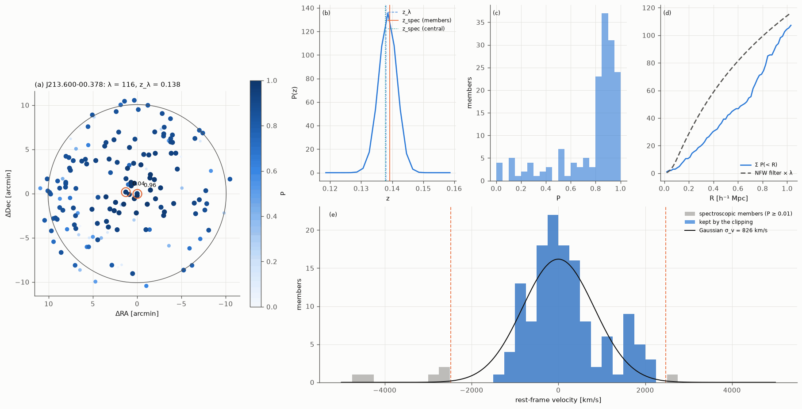

   The cluster with the most spectroscopic members among λ ≥ 80 at 0.1 < z < 0.3 (R14 Fig. 16; K24
   Fig. 4): (a) members coloured by P, with R_λ and the centre candidates (P_cen); (b) P(z) with
   z_λ and the spectroscopic redshifts of the members and of the central; (c) distribution of P;
   (d) Σ P within R against the NFW filter of the richness normalised to λ; (e) rest-frame
   velocities of the spectroscopic members, the members kept by the 3σ clipping and a Gaussian
   of the measured σ_v.

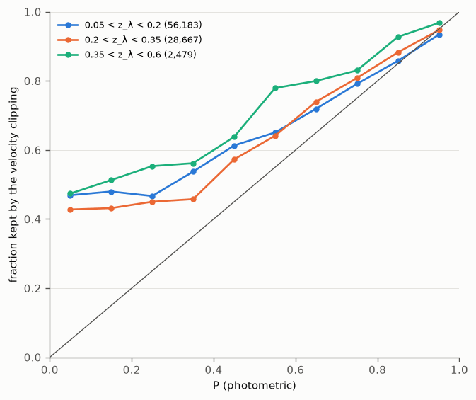

   Fraction of the spectroscopic members (not the central) kept by the velocity clipping, in
   bins of P, for clusters with at least 10 spectroscopic members (Rozo et al. 2015b Fig. 8;
   Rines et al. 2018 Fig. 14). The fraction follows P above P ≈ 0.6 but stays at ≈ 0.45 at low P:
   the spectroscopic targets are bright and red, and the clipping keeps every galaxy within
   ±3σ_v, including the interlopers projected in velocity (the next figure).

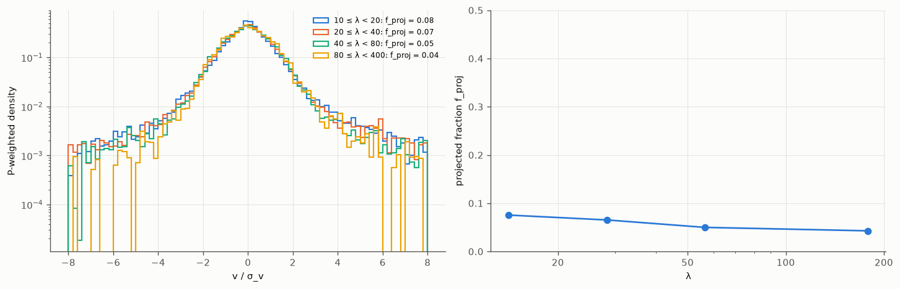

   P-weighted velocities of the spectroscopic members in units of each cluster's σ_v, stacked in
   bins of λ, and the fraction in a flat (projected) component fitted with a Gaussian (Myles et
   al. 2021 Fig. 3; Myles et al. 2025 Fig. 4). The projected fraction is 4–8%, decreasing with λ.
   It is a lower limit: Myles et al. also model the interlopers that fall inside the cluster
   Gaussian, which this simple fit does not separate.

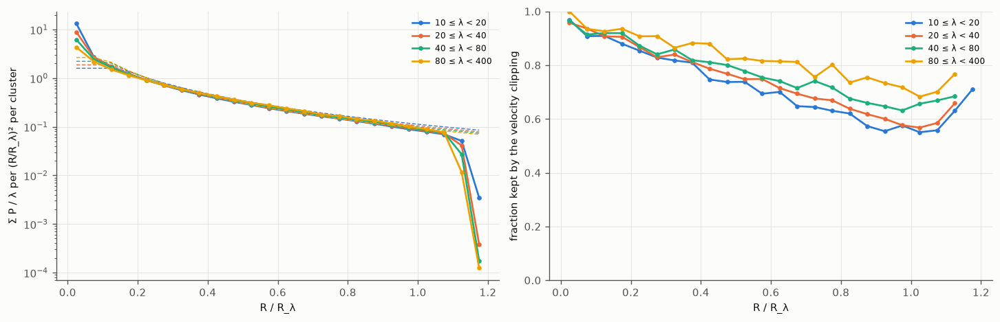

   Left: stacked surface density of membership probability, Σ P per unit area divided by λ,
   against R/R_λ in four λ bins, with the NFW filter of the richness (dashed; R14 Fig. 16). The
   profiles are self-similar in R/R_λ; the first bin holds the central galaxy, and the drop beyond
   R_λ is the radial cut. Right: fraction of spectroscopic members kept by the clipping against
   R/R_λ (Tomooka et al. 2020 Fig. 2): from 95% at the centre to 55–75% at R_λ, higher for richer
   clusters.

Reproduce
---------

The figures are made by the scripts of ``docs/figures/redmapper_dr11``; they read the
production catalogues, one DR11 randoms file and public cluster catalogues, and need no GPU,
only ``colossus`` (halo mass function) and ``pandas`` (CDS tables) besides rema and matplotlib:

.. code-block:: bash

   python docs/figures/redmapper_dr11/make_all.py          # prepare.py, then every fig_*.py
   python docs/figures/redmapper_dr11/fig_redshifts.py     # one group of figures
   python docs/notebooks/build_notebooks.py redmapper --execute --kernel <kernel>

``prepare.py`` reduces the catalogues (the clusters, the members with P ≥ 0.05 or a spectroscopic
redshift) and the randoms (HEALPix maps at NSIDE 256) to a work directory, once (about 12
minutes for one part on a laptop, mostly reading the 23 GB randoms file); the figure scripts
then take 3 minutes together. ``make_all.py`` writes the
PNG files next to the scripts and the table of numbers (``values.rst``). The notebook
:doc:`notebooks/redmapper_dr11` is assembled from the same scripts, cell by cell, and shows the
figures inline. Paths come from environment variables (defaults in ``common.py``):

.. list-table::
   :header-rows: 1
   :widths: 22 78

   * - Variable
     - Default and content
   * - ``REMA_PRODUCTS``
     - ``$LEGACYSURVEY_DIR/dr11/south/rema``: the production runs ``rema_dr11_v0.2.0_ra0-240``
       and ``rema_dr11_v0.2.0_ra240-360`` (the DR11 data system at CC-IN2P3 when ``/sps`` is
       mounted)
   * - ``REMA_WORK``
     - ``$REMA_PRODUCTS/notebooks``: the reduced tables, maps and ``values.json`` go to
       ``$REMA_WORK/redmapper``. Set it to a directory of yours when the products are not
       (at CC-IN2P3: :ref:`cc-notebooks`)
   * - ``REMA_RANDOMS``
     - ``$LEGACYSURVEY_DIR/dr11/south/randoms/randoms-south-1-0.fits``
   * - ``REMA_EXTERNAL``
     - ``$REMA_PRODUCTS/external`` if it exists, else ``~/data/cluster_catalogues``: the public
       catalogues below (a missing one is skipped)

External catalogues, as downloaded on 2026-10-07:

.. list-table::
   :header-rows: 1
   :widths: 30 70

   * - Catalogue
     - Source
   * - SDSS DR8 redMaPPer v6.3 (R16)
     - CDS ``J/ApJS/224/1``, ``cat_dr8.dat``
   * - DES Y1 redMaPPer v6.4 (McClintock et al. 2019)
     - DES public release, ``redmapper_y1a1_public_v6.4_catalog.fits``
   * - eRASS1 clusters (Bulbul et al. 2024; optical properties K24)
     - eROSITA DR1, ``erass1cl_primary_v3.2.fits`` and ``eRASS1_clusters_optical.fits``
   * - ACT DR6 clusters (ACT Collaboration 2025)
     - ``DR6_cluster-catalog_v1.0.fits`` (extragalactic.phys.wits.ac.za)
   * - ACT DR5 clusters (Hilton et al. 2021)
     - ``ACT_DR5_cluster-catalog_v1.1.fits``
   * - SPT-SZ 2500d (Bocquet et al. 2019)
     - ``2500d_cluster_sample_Bocquet19.fits``
   * - Planck PSZ2 (Planck Collaboration 2016)
     - Planck Legacy Archive, ``HFI_PCCS_SZ-union_R2.08.fits``
   * - MCXC (Piffaretti et al. 2011)
     - ``mcxc.fits``
   * - Wen & Han (2024)
     - CDS ``J/ApJS/272/39``, ``table2.dat``

Literature
----------

Papers whose figures are reproduced or used as references on this page:

.. list-table::
   :header-rows: 1
   :widths: 34 16 50

   * - Paper
     - arXiv
     - Used here
   * - Rykoff et al. 2014, ApJ 785, 104 (redMaPPer I, SDSS DR8)
     - `1303.3562 <https://arxiv.org/abs/1303.3562>`__
     - Figs. 1, 3–5 (red sequence), 7, 9–12 (redshifts), 16 (example cluster), 17–19 (density,
       λ–z), 27 (SCALEVAL)
   * - Rozo & Rykoff 2014, ApJ 783, 80 (redMaPPer II)
     - `1303.3373 <https://arxiv.org/abs/1303.3373>`__
     - Fig. 4 (recovery of X-ray clusters)
   * - Rozo et al. 2015, MNRAS 450, 592 (redMaPPer III, Planck)
     - `1401.7716 <https://arxiv.org/abs/1401.7716>`__
     - Fig. 2 (λ against SZ mass)
   * - Rozo et al. 2015, MNRAS 453, 38 (redMaPPer IV, membership)
     - `1410.1193 <https://arxiv.org/abs/1410.1193>`__
     - Fig. 8 (P against spectroscopic membership)
   * - Rykoff et al. 2016, ApJS 224, 1 (DES SV, SDSS DR8 v6.3)
     - `1601.00621 <https://arxiv.org/abs/1601.00621>`__
     - Figs. 1–6 (depth, density maps, redshifts, comoving density), 11–12 (centring)
   * - Kluge et al. 2024, A&A 688, A210 (eRASS1 identification, LS DR10)
     - `2402.08453 <https://arxiv.org/abs/2402.08453>`__
     - Figs. 2–4, 7, 10–13, 16–18, B.1–B.3, C.1; the eRASS1 λ_norm and z_vlim
   * - Bulbul et al. 2024, A&A 685, A106 (eRASS1 clusters)
     - `2402.08452 <https://arxiv.org/abs/2402.08452>`__
     - eRASS1 positions, masses and luminosities
   * - Ider Chitham et al. 2020, MNRAS 499, 4768 (CODEX)
     - —
     - Eq. 1 (Legacy Surveys against SDSS λ)
   * - McClintock et al. 2019, MNRAS 482, 1352 (DES Y1)
     - `1805.00039 <https://arxiv.org/abs/1805.00039>`__
     - DES Y1 redMaPPer catalogue
   * - Zhang et al. 2019, MNRAS 487, 2578 (DES Y1 miscentring)
     - `1901.07119 <https://arxiv.org/abs/1901.07119>`__
     - Figs. 1, 3 (centre offsets)
   * - Saro et al. 2015, MNRAS 454, 2305 (SPT × redMaPPer)
     - `1506.07814 <https://arxiv.org/abs/1506.07814>`__
     - Fig. 4 (λ against SPT mass)
   * - Bleem et al. 2020, ApJS 247, 25 (SPT-ECS)
     - `1910.04121 <https://arxiv.org/abs/1910.04121>`__
     - Fig. 9 (λ against SZ significance and mass)
   * - Seppi et al. 2023, A&A 671, A57 (eRASS1 and eFEDS offsets)
     - `2212.10107 <https://arxiv.org/abs/2212.10107>`__
     - X-ray–optical offsets
   * - Hilton et al. 2021, ApJS 253, 3 (ACT DR5)
     - `2009.11043 <https://arxiv.org/abs/2009.11043>`__
     - ACT DR5 catalogue
   * - ACT Collaboration 2025 (ACT DR6 clusters)
     - `2507.21459 <https://arxiv.org/abs/2507.21459>`__
     - ACT DR6 catalogue
   * - Rines et al. 2018, ApJ 862, 172 (HeCS-redMaPPer)
     - `1712.00212 <https://arxiv.org/abs/1712.00212>`__
     - Fig. 14 (spectroscopic member fraction against P)
   * - Myles et al. 2021, MNRAS 505, 33 (projection effects, SDSS)
     - `2011.07070 <https://arxiv.org/abs/2011.07070>`__
     - Fig. 3 (projected fraction against λ)
   * - Myles et al. 2025 (projection effects, DESI)
     - `2506.06249 <https://arxiv.org/abs/2506.06249>`__
     - Fig. 4 (projected fraction against λ and z)
   * - Wetzell et al. 2022, MNRAS 514, 4696 (DES Y3 velocity dispersions)
     - `2107.07631 <https://arxiv.org/abs/2107.07631>`__
     - Fig. 3 (σ_v against λ)
   * - Tomooka et al. 2020 (clusters have edges)
     - `2003.11555 <https://arxiv.org/abs/2003.11555>`__
     - Fig. 2 (spectroscopic members against radius)
   * - Baxter et al. 2016, MNRAS 463, 205 (redMaPPer clustering)
     - `1604.00048 <https://arxiv.org/abs/1604.00048>`__
     - Fig. 2 (density against observing conditions)
   * - Wen & Han 2024, ApJS 272, 39 (1.58 million clusters)
     - `2404.02002 <https://arxiv.org/abs/2404.02002>`__
     - Fig. 10 (cross-identification)
   * - Zou et al. 2021, ApJS 253, 56 (Legacy Surveys clusters)
     - `2101.12340 <https://arxiv.org/abs/2101.12340>`__
     - Fig. 9 (match rate with redMaPPer)
   * - Comparat et al. 2025, A&A 700, A271
     - `2504.10241 <https://arxiv.org/abs/2504.10241>`__
     - Table 2 (g − r red sequence)
   * - Tinker et al. 2008, ApJ 688, 709
     - `0803.2706 <https://arxiv.org/abs/0803.2706>`__
     - Halo mass function

Further papers with figures in the same spirit, not reproduced here (they need injections, shear
catalogues or simulations): Costanzi et al. 2019 (`1807.07072 <https://arxiv.org/abs/1807.07072>`__,
injections), Lee et al. 2024 (`2410.02497 <https://arxiv.org/abs/2410.02497>`__), Kelly et al. 2024
(`2310.13207 <https://arxiv.org/abs/2310.13207>`__), Hikage et al. 2018
(`1702.08614 <https://arxiv.org/abs/1702.08614>`__), Oguri et al. 2018 (CAMIRA,
`1701.00818 <https://arxiv.org/abs/1701.00818>`__), Euclid Collaboration 2025 (XCI,
`2509.06805 <https://arxiv.org/abs/2509.06805>`__), DES Collaboration 2025 (Y3 clusters,
`2503.13632 <https://arxiv.org/abs/2503.13632>`__).
