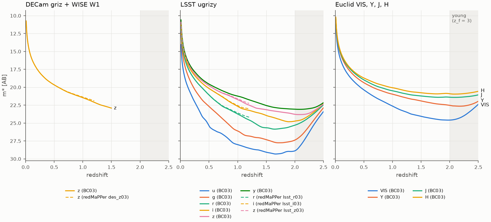
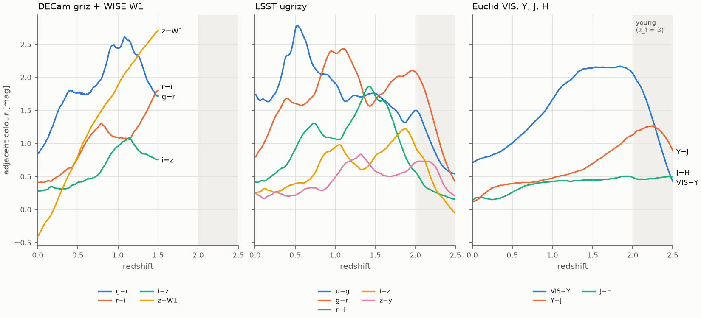

Model tables
============

rema ships small tables of m*(z) and of red-sequence colours, in ``rema/data``. They exist for
three filter sets: DECam griz with WISE W1 (the DR11 default), LSST ugrizy, and Euclid VIS, Y,
J, H. Any of them can drive a calibration through two configuration keys:

``model.mstar``
    m*(z) in the reference band (``survey.ref_band``). It sets the luminosity cut of λ
    (m < m* + 1.75), the spectroscopic seeds of the calibration (m < m* + 1), the faint limit of
    the background and the pivot magnitude of the red sequence.
``model.template``
    Adjacent colours of a passive population. They seed the calibration's initial red sequence,
    and their absolute level is refitted on the data. ``survey.bands`` must be among the
    template's bands, in the same order.

Available tables
----------------

The name in the first column is what ``model.mstar`` or ``model.template`` takes; the file is
``mstar_<name>.fits`` or ``colors_<name>.fits`` in ``rema/data``.

.. list-table::
   :header-rows: 1
   :widths: 24 12 18 12 34

   * - Name
     - Content
     - Bands
     - Redshifts
     - Source
   * - ``des_z03`` (default)
     - m*(z)
     - DECam z
     - 0.01–1.51
     - redMaPPer ``mstar_des_z03.fit``, extrapolated above z = 1.2
   * - ``lsst_r03``, ``lsst_i03``, ``lsst_z03``
     - m*(z)
     - LSST r, i, z
     - 0.01–1.51
     - redMaPPer ``mstar_lsst_*03.fit``, extrapolated above z = 1.2
   * - ``legacy_z_ezgal``
     - m*(z)
     - DECam z
     - 0.01–1.50
     - BC03 passive population (below)
   * - ``lsst_u_ezgal`` … ``lsst_y_ezgal``
     - m*(z)
     - each LSST band
     - 0.01–2.50
     - BC03 passive population
   * - ``euclid_vis_ezgal``, ``euclid_y_ezgal``, ``euclid_j_ezgal``, ``euclid_h_ezgal``
     - m*(z)
     - each Euclid band
     - 0.01–2.50
     - BC03 passive population
   * - ``bc03_legacy_grizw1`` (default)
     - colours
     - g−r, r−i, i−z, z−W1
     - 0.01–1.50
     - BC03 passive population
   * - ``bc03_lsst_ugrizy``
     - colours
     - u−g, g−r, r−i, i−z, z−y
     - 0.01–2.50
     - BC03 passive population
   * - ``bc03_euclid_visyjh``
     - colours
     - VIS−Y, Y−J, J−H
     - 0.01–2.50
     - BC03 passive population

m*(z) tables are interpolated with a natural cubic spline; beyond their range m* is held at the
last value, so keep ``model.zrange`` (and ``scan.zrange``) inside it.

   m*(z) of the passive population in each band (solid) and redMaPPer's empirical tables where
   they are tabulated (dashed, z ≤ 1.2). The shaded range is z > 2, where the population, formed
   at z_f = 3, is younger than about 1 Gyr.

   Adjacent colours of the same population. The colour tables seed the calibration; the
   calibrated red sequence replaces them.

Calibrating with LSST or Euclid photometry
------------------------------------------

The bands, the reference band, the m*(z) table and the template go in the configuration. For
LSST griz y with z as the reference band:

.. code-block:: yaml

   survey:
     bands: [g, r, i, z, y]
     ref_band: z
   model:
     mstar: lsst_z03          # or lsst_z_ezgal, the BC03 m* in LSST z
     template: bc03_lsst_ugrizy
     zrange: [0.05, 1.2]

For Euclid, with H as the reference band:

.. code-block:: yaml

   survey:
     bands: [vis, y, j, h]
     ref_band: h
   model:
     mstar: euclid_h_ezgal
     template: bc03_euclid_visyjh
     zrange: [0.1, 1.8]

The calibration builds its initial red sequence from these keys. The same call in Python shows
the starting colours and m* before running anything:

.. code-block:: python

   from rema.config import RemaConfig
   from rema.model.profiles import MStar
   from rema.model.redsequence import RSModel

   cfg = RemaConfig().replace(survey={"bands": ("g", "r", "i", "z", "y"), "ref_band": "z"},
                              model={"mstar": "lsst_z03", "template": "bc03_lsst_ugrizy"})
   rs0 = RSModel.from_template(bands=cfg.survey.bands, ref_band=cfg.survey.ref_band,
                               template=cfg.model.template, mstar=cfg.model.mstar)
   print(rs0.at(0.5).mean)               # g-r, r-i, i-z, z-y at z = 0.5
   print(round(float(MStar(cfg.model.mstar)(0.5)), 3))

.. code-block:: text

   [1.6047 0.9074 0.3919 0.2166]
   19.76

Then calibrate as for DR11 (:doc:`dr11`, step 4), with the configuration written to a file:

.. code-block:: bash

   rema calibrate --galaxies galaxies.fits --footprint footprint.fits --config lsst.yaml \
                  --out calib.fits --plots calib_plots

- ``rema ingest`` reads Legacy Surveys sweeps only. For LSST or Euclid catalogues, write the
  galaxy table yourself with the columns of the ``GALAXIES`` product (:doc:`reference`):
  ``FLUX`` and ``FLUX_IVAR`` with one column per band of ``survey.bands``, in that order, as
  dereddened nanomaggies (AB zero point 22.5), ``REFMAG`` and ``REFMAG_ERR`` in the reference
  band, and ``ZSPEC`` (−1 when there is none) for the spectroscopic seeds.
- The calibration stores its configuration, so blind and scan runs made with the calibration
  file use the same bands and tables.
- Above z ≈ 2 the BC03 tables describe a young population; do not calibrate there with them.

Other band combinations
~~~~~~~~~~~~~~~~~~~~~~~

A template for another combination, for example LSST griz y with Euclid J and H, is built
with the same code as the packaged tables. Every response file listed in
``rema.data.build.INPUTS`` can be used:

.. code-block:: python

   from rema.data.build import FilterSet, build_bc03_tables
   from rema.io.tables import write_table

   fs = FilterSet("lsst_euclid", ("g", "r", "i", "z", "y", "jE", "hE"),
                  ("lsst2023-g.ecsv", "lsst2023-r.ecsv", "lsst2023-i.ecsv", "lsst2023-z.ecsv",
                   "lsst2023-y.ecsv", "Euclid-J.ecsv", "Euclid-H.ecsv"),
                  mstar_bands=("z", "hE"), zmax=2.5, description="LSST grizy + Euclid J, H")
   for name, (cols, header) in build_bc03_tables(fs).items():
       write_table(name, cols, header=header)
       print(name)

.. code-block:: text

   mstar_lsst_euclid_z_ezgal.fits
   mstar_lsst_euclid_hE_ezgal.fits
   colors_bc03_lsst_euclid_grizyjEhE.fits

Then set ``model.template`` to the path of the colours file and ``model.mstar`` to the path of
the m* file of the reference band. The band names (``jE``, ``hE`` here) are those of
``survey.bands``.

Values
------

The figures' data at a few redshifts (m* in AB magnitudes, colours in magnitudes):

.. include:: figures/model_tables_values.rst

The passive population and the inputs
-------------------------------------

The BC03 tables follow one population: Bruzual & Charlot (2003), Salpeter IMF, metallicity
Z = 0.02 (the SSP grid distributed with EzGal, Mancone & Gonzalez 2012), exponential star
formation with τ = 0.1 Gyr from z_f = 3, normalised to SDSS i = 17.85 (AB) at z = 0.2, in a flat
cosmology with Ω_m = 0.3 and h = 0.7. :mod:`rema.model.sps` integrates the exponential history
exactly over the SSP ages and evaluates every redshift directly.

.. list-table::
   :header-rows: 1
   :widths: 22 78

   * - Filter set
     - Responses (speclite, commit ``8159ea6``)
   * - ``legacy``
     - ``decam2014-{g,r,i,z}`` and ``wise2010-W1``
   * - ``lsst``
     - ``lsst2023-{u,g,r,i,z,y}``: tag 1.9 of lsst/throughputs, with the airmass-1.2 standard
       atmosphere
   * - ``euclid``
     - ``Euclid-{VIS,Y,J,H}``: end-of-life total throughputs, NISP included for Y, J, H (ESA
       NISP-PHOTO-PASSBANDS-V1)

The SSP grid comes from EzGal (commit ``de4a588``) and redMaPPer's m* tables from redMaPPer
(commit ``601994a``). All inputs are downloaded once (14 MB), checked against their SHA-256 and
cached in ``$REMA_CACHE_DIR/inputs`` (else ``~/.cache/rema/inputs``). To rebuild or check the
tables, and to redraw this page's figures:

.. code-block:: bash

   python -m rema.data.build --check        # compare with the packaged tables
   python -m rema.data.build                # rewrite them
   python docs/figures/make_model_tables.py

In LSST i and z the BC03 m* is within 0.09 mag of redMaPPer's empirical tables up to z = 0.9.
The DECam tables replace earlier ones made with EzGal itself, which interpolated on a coarser
redshift grid; the two differ by at most 0.007 mag in m* and 0.022 mag in the colours.
